# 当前 UI 截图参考与已知问题

本目录把用户在 UI 改造讨论中提供的真实截图与视觉参考固化到 `UIproduct`。网页版 GPT 必须查看这些图片，但不能把截图中的旧文字、测试数据或内部字段当作新的功能真值。

## 使用方式

- 功能、状态、事件和接口以 `design/function-truth-table.md` 与当前代码为准
- 截图用于识别可读性、密度、视觉语言和真实设备问题
- 历史报错截图不代表当前代码仍然失败
- ImageGen 参考图只提供视觉语言，不授权复制虚构数据或功能
- 每个页面仍需使用自身最新截图、ImageGen 和 Figma node 做独立审查

## 01 WXSS 编译错误

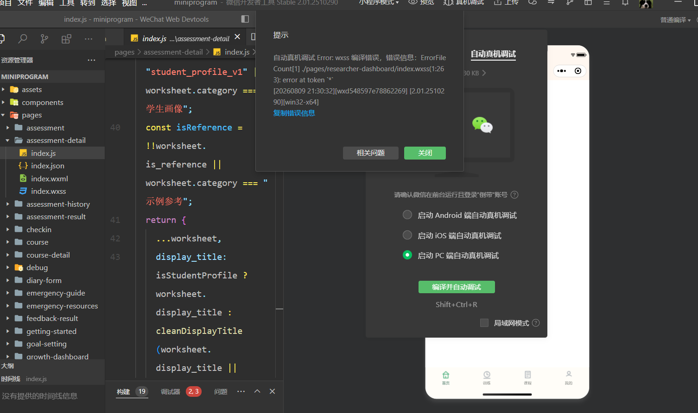

历史问题：`pages/researcher-dashboard/index.wxss` 曾在压缩后的首行出现 `token *` 编译错误。后续代码不得使用微信 WXSS 不支持的选择器或语法；必须以微信开发者工具编译结果为证据。

## 02 重复侧边线问题

已知问题：重复长竖线形成栅栏感，容易暴露批量模板。后续优先使用短线、开放式转角、编号、留白或单个自然物象标记，不让装饰与正文机械等高。

## 03 紧急帮助说明的开放式标记

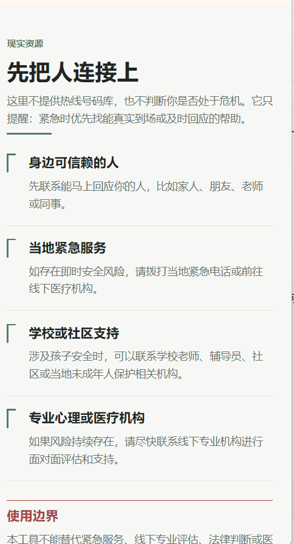

可借鉴：标题清楚、正文可扫读、开放式转角比长竖线自然。不可照搬：该截图不是其他页面的通用模板；每页仍需按真实任务组织信息。

## 04 竹影与自然物象方向

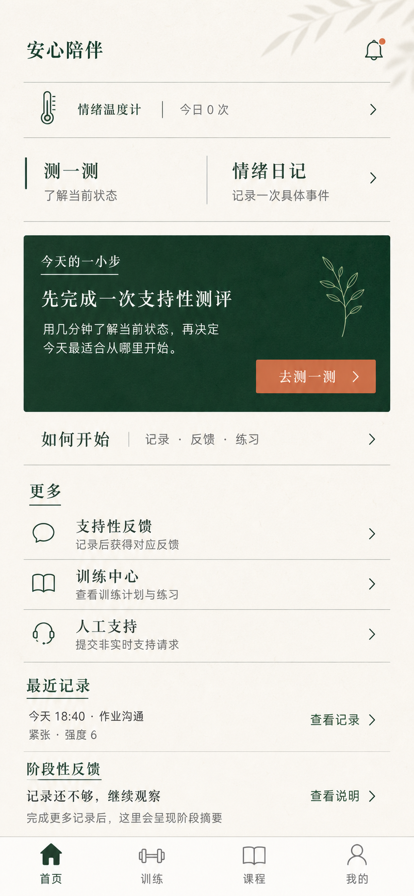

可借鉴：页头低透明竹叶、重点卡片内的单线竹枝、纸张般温润底色。禁止照搬图中的数据、入口和文案；自然物象不可点击，不承担状态、进度或风险含义，每屏默认不超过一个。

## 05 研究者在线分析页

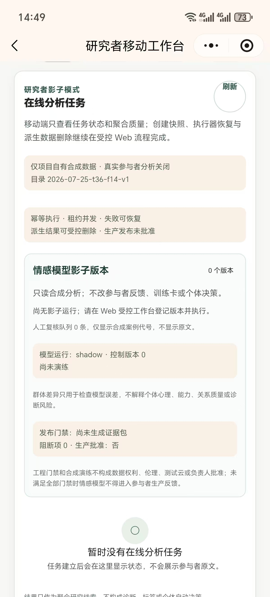

主要问题：说明与边界重复、卡片套卡片、技术状态占据主体、连续小字过多。研究者端可以密集，但应改用结构化分组、表格、摘要和按需展开。

## 06 研究者评估证据页

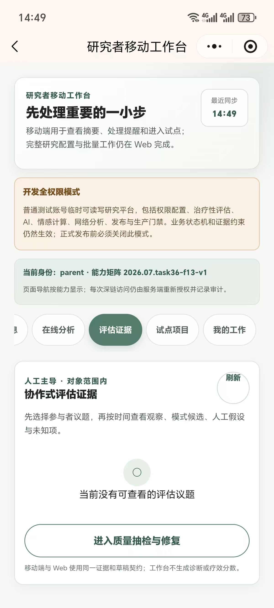

主要问题：权限说明、身份说明、横向胶囊导航和空状态同时竞争注意力。页面应先突出当前研究任务，再把系统模式与治理说明放入次级信息区。

## 07 参与者档案与阶段报告

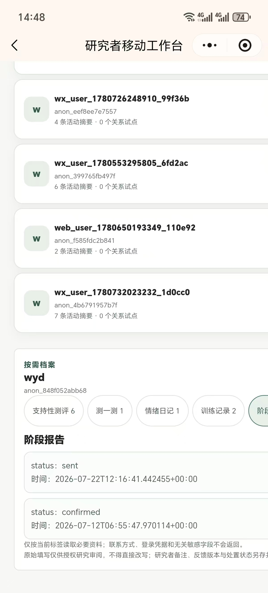

主要问题：内部用户 ID、匿名标识、原始状态值和 ISO 时间直接暴露。显示层应转换为可读名称、状态和日期，不改接口字段。

## 08 参与者档案与支持性测评

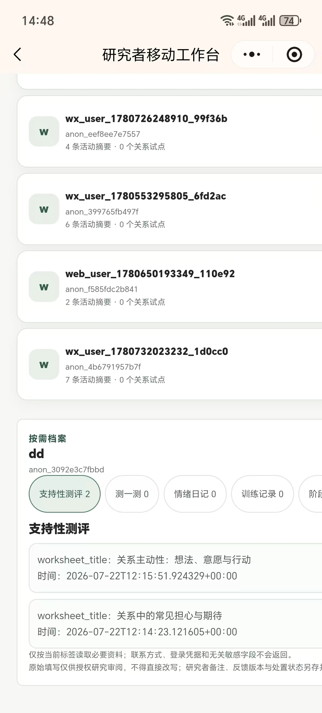

主要问题：机器字段 `worksheet_title` 和 ISO 时间直接显示，横向标签过多。筛选可以保留，但字段名和日期必须人类化。

## 09 研究者移动工作台

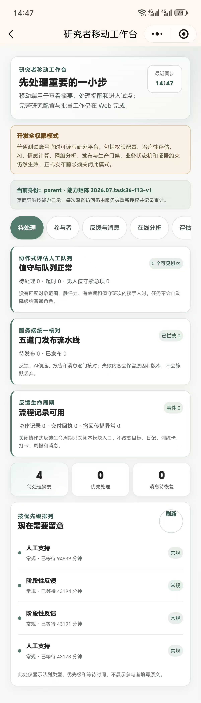

主要问题：长卡片连续堆叠、重复说明、胶囊导航拥挤、小字号承载关键状态。研究者首页应先给待处理任务、优先级和恢复动作，再展开证据或治理信息。

## 10 支持性问答

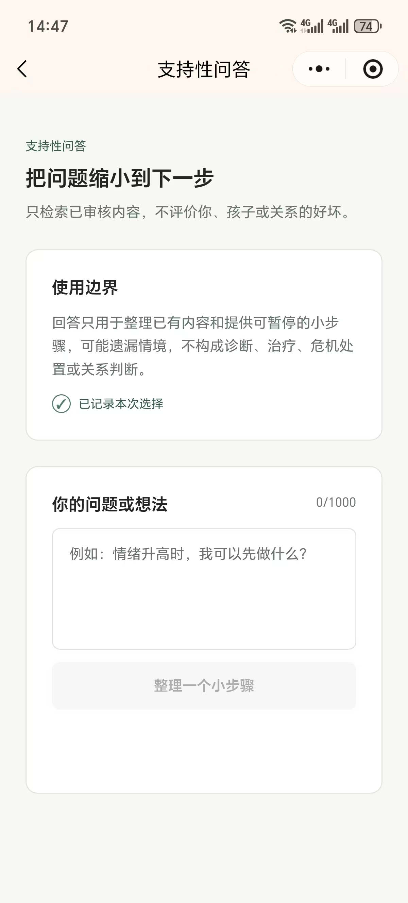

可借鉴：标题、边界、输入和主行动层级较清楚。需要注意：不要为了留白拉长空容器；字数、错误和恢复动作仍需靠近输入区。

## 11 训练页

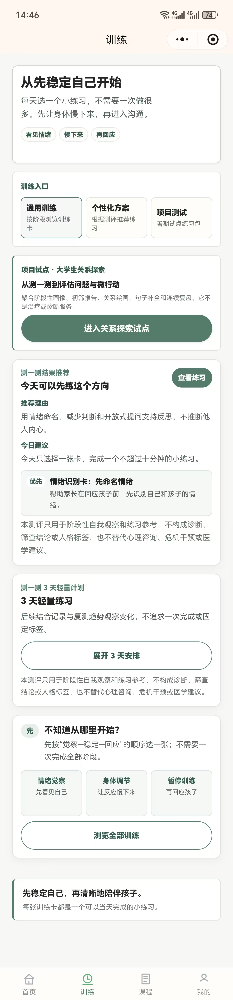

主要问题：卡片墙、标签和说明过多，非诊断边界在多个卡片中重复，小字号阅读负担高。训练页应优先“继续练习”，把介绍、推荐理由和边界合并或按需展开。

## 12 首页真实页面

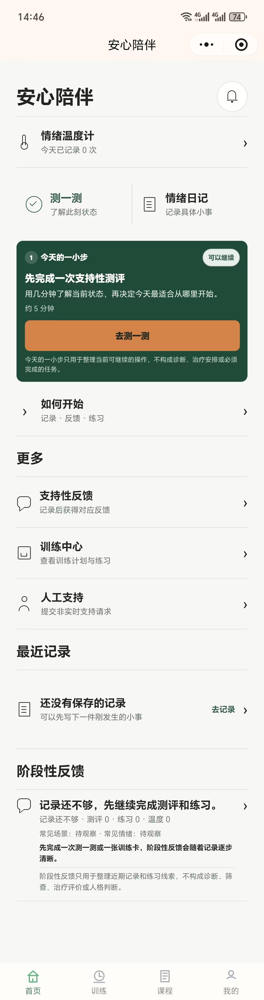

可借鉴：情绪温度计保持真实名称，主行动明确，列表结构比卡片墙简洁。需要继续检查：底部阶段性反馈的信息密度、长文本、大字体和真机安全区。
