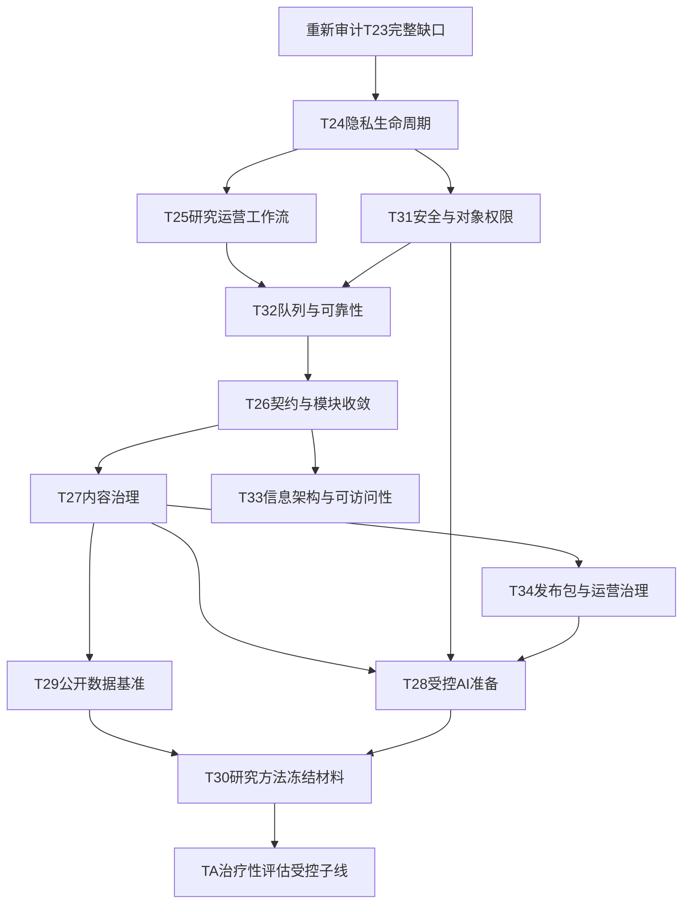

# 任务二十三至三十四完整实现主计划

日期：2026-07-20

状态：`authoritative_full_implementation_plan`

## 1. 计划用途

本计划把原来的“最小可演示切片”升级为“完整实现”口径。后续仍按小步开发，但小步只是施工方式，不再是大任务的完成标准。

权威关系：

1. 本文负责任务二十三至三十四的完整实现范围、完成定义、依赖和验收；
2. `任务二十三至二十九逐步开发任务清单.md`和`任务二十三至三十四全量深化优化总蓝图_20260718.md`继续提供原始需求，不再单独决定“已完成”；
3. `任务二十三至三十四治疗性评估受控接入子线_20260719.md`继续管理TA-00至TA-08和D01至D26人工门禁；
4. 当前事实以`docs/00_当前事实基准/项目进度统一口径.md`、`当前进度交接.md`和本计划状态表共同确认。

## 2. 完整实现的完成定义

每个任务必须分别记录以下状态，禁止把其中一个状态替代全部完成：

| 状态 | 含义 |
|---|---|
| `planned_full` | 完整范围、依赖、失败场景和回滚已经登记 |
| `implementation_in_progress` | 正在开发，尚不能作为完整能力使用 |
| `engineering_complete` | 后端、数据库、共享契约、前端、权限、审计、恢复、迁移和自动回归完成 |
| `external_validation_pending` | 工程完成，但真机、云环境、真人研究或专业审核尚未通过 |
| `release_approved` | 工程完成且所有适用人工门禁、外部环境和负责人签字通过 |
| `blocked_human_gate` | 工程可继续准备，但不得接真实参与者或生产数据 |

### 2.1 工程完整门禁

适用模块必须全部满足：

- 后端业务规则集中在明确模块中，路由不堆积状态机；
- SQLite和MySQL schema一致，提供空库、旧库、重复执行、失败回滚和备份恢复验证；
- API具有统一分页、枚举、错误包络、request_id、幂等和并发冲突语义；
- `shared`、Web client和小程序client使用同一字段、状态和端点；
- 小程序和Web均覆盖加载、空、错误、重试、成功、重复提交和权限不足；
- 写操作进行对象级权限检查，敏感读取与所有状态变化写审计；
- 不记录令牌、密钥、联系方式、参与者自由文本或内部堆栈；
- 具备功能开关、默认关闭值、失败降级和回滚路径；
- 专项测试、后端全量、内容校验、Web typecheck/build、小程序JS/JSON和`git diff --check`通过；
- 涉及界面的任务通过桌面/窄屏/键盘/焦点/触控尺寸/横向溢出自动检查；
- API、数据库、设计系统、执行记录、开发日志、交接和开发说明同步更新。

### 2.2 发布批准门禁

按任务需要补充：

- 微信开发者工具编译；
- Android和iOS真机；
- 大字体、读屏、弱网和中断恢复；
- 测试云CloudBase、真实MySQL、备份恢复和双账号并发；
- 量表版权、心理、伦理、研究和法律审核；
- 真实责任人、值守、风险转介和停用联系人；
- 真人认知访谈、小流量试点和不良事件复盘。

## 3. 自动执行机制

建立机器可读任务注册表和单一执行器：

```text
scripts/run_tasks_23_34.py
config/task23_34_registry.json
.codex_tmp/task23_34_state.json
docs/02_专项进度与验收/任务二十三至三十四完整实现执行记录.md
```

执行器接口：

```powershell
python scripts/run_tasks_23_34.py plan
python scripts/run_tasks_23_34.py run --next
python scripts/run_tasks_23_34.py resume
python scripts/run_tasks_23_34.py verify --task T24-02
python scripts/run_tasks_23_34.py report
```

每个切片固定执行：事实核对 → 失败契约 → 实现 → 专项测试 → 全量回归 → 安全/伦理扫描 → 文档 → 独立提交。

失败分类：

- `code_failure`：自动诊断、修复并重跑；
- `contract_drift`：停止依赖任务，先修复共享契约；
- `feature_conflict`：保持现有功能，记录冲突等待负责人决策；
- `environment_missing`：生成外部环境验收包，继续无依赖任务；
- `human_gate`：生成签字材料，不自动批准；
- `security_blocked`：立即停止相关分支并保全证据。

## 4. 执行波次与依赖



任务可并行准备，但同一数据库、权限或共享契约文件一次只允许一个切片修改。

## 5. 任务二十三：参与者主旅程完整收口

当前状态：`external_validation_pending / full_gap_reaudit_required`。

此前T23-00至T23-05本地切片完成，但T23-03只完成推荐降权最小切片，T23-05仍缺外部验收，因此必须重新执行完整差距审计。

完整范围：

1. T23-F01统一今日行动状态机：记录、测评、训练、消息、阶段反馈、暂停、完成、失败、弱网恢复和治疗性评估受控状态；
2. T23-F02统一反馈账本：版本历史、幂等、撤回、纠错、不适转人工、参与者可见状态和研究者聚合；
3. T23-F03完整推荐使用显式反馈：当前有效反馈、替代卡、冷启动、重复控制、排序原因、版本回放、功能开关和旧策略回滚；
4. T23-F04成长总览保持分量尺展示，禁止单一成长分；所有入口、时间线、消息和阶段反馈可追溯；
5. T23-F05完成小程序/Web公共状态、无障碍、弱网、草稿恢复和四视口回归；
6. T23-F06补齐产品事件：展示、点击、完成、跳过、失败恢复、不适和人工升级；
7. T23-F07完成微信开发者工具、Android/iOS、大字体、读屏和真实账号验收。

完整验收：核心旅程所有状态可重复构造；推荐可解释且可回滚；失败不伪装空状态；首页原布局不移动；临时展示越权不计入正式权限验收。

## 6. 任务二十四：隐私与数据生命周期完整闭环

当前状态：`engineering_complete_local / release_approval_pending`。2026-07-20已按F01—F10补齐本地工程链路；负责人保存矩阵、测试云、真机、伦理/法律和生产发布仍未批准。

完整范围：

1. T24-F01参与者隐私中心：Web和小程序均可提交、分页查看、取消待处理申请并看到更新时间；
2. T24-F02受控处理：仅管理员/督导可查看详情、领取、退回、驳回；研究者只可看到与研究授权有关的非执行状态，无删除执行权；
3. T24-F03动作账本：每次状态变化记录处理人、角色、范围、备注、前后状态、幂等键、时间和审计；
4. T24-F04范围预览：按白名单模块返回记录数、处理方式、保留依据、备份影响和不可逆提示；不返回敏感原文；
5. T24-F05真实执行器：事务化删除/匿名化、乐观锁、dry-run、失败整笔回滚、重复执行安全和执行证明；
6. T24-F06数据面覆盖：主库、消息、导出、离线分析、缓存、搜索索引和备份分别定义删除、匿名化或依法保留；
7. T24-F07撤回研究授权：阻断新导出、离线分析、AI训练和研究队列，同时不破坏独立服务同意；
8. T24-F08恢复与申诉：驳回理由参与者可见为安全摘要；误操作仅在可恢复窗口和规则允许时处理；
9. T24-F09SQLite/MySQL迁移、并发双处理人、重复点击、进程中断和备份恢复测试；
10. T24-F10负责人确认数据保存矩阵后，才允许执行器接测试云；生产仍需单独开关和双人批准。

### 2026-07-20执行记录

- F01—F09工程实现完成：后端、数据库、shared、Web、小程序、权限、审计、异常回滚、SQLite/MySQL迁移契约、恢复墓碑和自动验收均已补齐。
- F10只生成发布门禁证据包；保存矩阵、伦理/法律、测试云、真机和生产双人批准均保持未签字。
- 正式执行三个开关默认关闭；只在临时合成SQLite库验证真实事务，不连接测试云或生产库。
- 临时展示越权继续保留，但后端正式角色矩阵单独测试；不得以页面可见性通过权限验收。
- 执行记录：`docs/02_专项进度与验收/任务二十四完整实现执行记录_20260720.md`。
- 门禁证据包：`docs/02_专项进度与验收/任务二十四发布门禁证据包_20260720.md`。

完整验收：参与者、研究者、督导、管理员、跨用户和重复请求矩阵全通过；删除证明确认所有查询、导出和离线产物不再返回目标数据；审计和依法保留内容按规则保留且不泄露原文。

## 7. 任务二十五：研究运营处置工作台完整闭环

当前状态：`engineering_complete_local / release_approval_pending`。2026-07-20已完成F01—F08本地工程闭环；测试云MySQL、真实双账号、微信开发者工具/真机和生产运营批准仍待外部验收。

完整范围：

1. T25-F01统一工作项模型：类型、优先级、状态、负责人、租约、等待时间、到期时间、版本和来源对象；
2. T25-F02领取、并发冲突、续租、退回、转交、补充说明、完成、关闭和重新打开；
3. T25-F03原始参与者内容只读，处理备注、参与者消息和内部备注分表保存；
4. T25-F04通知失败按错误代码区分重试、重新授权、模板错误和永久失败；
5. T25-F05指数退避、最大次数、死信、人工恢复和站内消息去重；
6. T25-F06阶段反馈、人工支持、风险复核、不适反馈和隐私请求使用一致交互，但保持各自权限；
7. T25-F07工作量、超时、关闭原因和积压趋势可观测，不用完成数量考核心理工作质量；
8. T25-F08桌面/窄屏、键盘、空/错/重试、多人并发和进程中断测试。

执行证据不另建任务文件，统一记录在`docs/00_当前事实基准/Claude计划模式.md`的“任务二十五完整实现执行结果”段落。生产写操作默认关闭；临时展示越权继续保留但不覆盖工作项写接口，也不作为权限验收证据。

## 8. 任务二十六：API契约与模块完整收敛

当前状态：`engineering_complete_local / release_approval_pending`。2026-07-20已完成F01—F07本地工程闭环；测试云回放、微信开发者工具/真机和生产流量兼容观察仍待外部验收。

完整范围：

1. T26-F01登记全部公开端点、角色、对象权限、请求/响应、枚举、分页、幂等和弃用状态；
2. T26-F02历史接口统一错误包络和request_id，保留兼容参数并记录弃用期限；
3. T26-F03由一份契约生成/校验shared类型、Web client、小程序client和API文档；
4. T26-F04 CI检测缺失端点、字段漂移、枚举漂移、错误码漂移和未文档化接口；
5. T26-F05关系试点enrollment/report/growth、消息、隐私和研究队列拆为深模块，公开URL不变；
6. T26-F06N+1、无界列表、敏感字段和跨用户参数自动扫描；
7. T26-F07提供契约快照、兼容期回放和逐模块回滚。

## 9. 任务二十七：内容治理工作台完整实现

当前状态：`engineering_complete_local / release_approval_pending`。

完整范围：

1. T27-F01训练卡、反馈规则、测评映射、课程、项目、FAQ和边界文本统一版本元数据；
2. T27-F02内容草稿、差异、校验、送审、驳回、批准、发布、暂停、退役和恢复状态机；
3. T27-F03研究、心理、伦理和内容角色分权，导入脚本不得自动升级批准状态；
4. T27-F04不可覆盖旧版本，发布采用不可变哈希包和原子切换；
5. T27-F05合成案例批量回放推荐、反馈、拒答、高风险阻断和边界文案；
6. T27-F06内容依赖检查：删除/退役卡片时列出训练计划、课程、项目和推荐规则影响；
7. T27-F07Web工作台完整覆盖草稿、diff、校验、审核轨迹和回滚证据；
8. T27-F08内容版权、来源、适龄性、审稿证据缺失时阻断发布。

执行记录（2026-07-20，直接记录于本任务）：

- F01：新增`content/content_governance_manifest.json`，统一登记训练卡、反馈规则、两类推荐映射、量表/题项、课程、项目、画像规则、FAQ占位和知情同意/隐私边界文本的来源、来源版本、版权、适龄、人群、变更摘要和治理状态；旧内容导入只产生`registered`，不会自动批准。
- F02/F04：数据库升至`2026_07_20_015 / content_governance_lifecycle`，新增不可变版本、专业审核和发布包三表；完成草稿、diff、自动校验、送审、驳回、四方批准、哈希发布、暂停、退役和按不可变包恢复。文件原子替换后若数据库切换失败会恢复原文件。
- F03/F08：研究、心理、伦理、内容四类批准受角色映射、证据路径和审核人独立性约束；同一人不能代表多个专业责任批准。版权/适龄/来源/变更摘要、边界文本、哈希或审核证据缺失均阻断发布；生产发布开关默认关闭，历史直接改JSON接口在治理强制环境禁用。
- F05/F06：新增不含真实数据的固定回放集，检查普通反馈、高风险阻断、推荐开关和边界提示；退役/暂停前扫描训练计划、课程、项目和推荐规则依赖并要求确认。
- F07：Web内容页升级为响应式治理工作台；shared、Web client、小程序client和148操作机器契约同步。小程序不增加研究者管理页面，只提供运行内容版本/哈希描述接口。
- 迁移/回滚：`migrate_task27_content_governance.py --apply`幂等建表，`--rollback-plan`只输出关闭发布开关、选择前一发布包和保留审计表的非破坏方案，不自动删表或签字。
- 自动验收：T27专项最终数字、后端全量、Web typecheck/build、Playwright、小程序静态、内容、契约漂移/兼容和diff结果以`Claude计划模式.md`任务二十七段为准。
- 外部门禁：研究/心理/伦理真实审稿人、版权许可原件、测试云MySQL、CloudBase、微信开发者工具、真机和生产发布/恢复演练未由系统代签；工程完成不等于发布批准。临时展示越权继续保留且不作为正式权限证据。

## 10. 任务二十八：受控AI自由问答完整实现

当前状态：`engineering_complete_local_synthetic / participant_release_blocked_human_gate`。

完整范围：

1. T28-F00负责人冻结服务名称、目标人群、允许范围、供应商、保存/出境、值守、危机转介和停用责任人；
2. T28-F01合成安全测试集覆盖产品、心理教育、反思、诊断越界、危机、虐待、注入、隐私索取和工具滥用；
3. T28-F02只检索已批准知识库，按内容ID、版本、治理状态过滤，回答逐段附来源；
4. T28-F03供应商中立适配器、fake provider、超时、限流、预算、熔断、审计、密钥隔离和默认关闭；
5. T28-F04调用前后双层安全路由、固定高风险响应、人工升级和安全降级；
6. T28-F05会话隔离、跨用户检索测试、删除/退出、纠错和不用于训练的默认策略；
7. T28-F06内部研究者沙盒展示来源、模型、提示版本、安全判定、成本和失败原因；
8. T28-F07离线阈值、人工盲审、红队、隐私评估和停用演练；
9. T28-F08只有T28-F00及T24/T31/T32/T34门禁通过后，才可申请真实低风险小流量；
10. T28-F09首轮AI不得调用写操作工具，不自动发消息、修改记录、安排任务或提交人工反馈。

执行记录（2026-07-20，直接记录于本任务）：

- F00/F08：`ai_qa_governance.json`完整登记服务名称、人群、允许范围、供应商、保存/出境、值守、危机转介和停用责任人的拟议值与待签状态；参与者开关强制为false。系统没有替负责人、心理、伦理、隐私、安全或生产签字，真实低风险申请仍被T24/T31/T32/T34和责任链阻断。
- F01/F04/F07：建立24例固定合成安全集、调用前风险/范围/隐私/注入路由、调用后诊断/保证/泄漏/引用检查、固定现实支持和安全降级；保存离线指标、阈值、人工复核证据和只允许停用的kill switch。工程阈值通过不等于人工盲审或发布批准。
- F02：检索层只连接T27 `published + active release`内容，按内容类型、ID、版本、发布ID和哈希返回引用；草稿、内部备注、参与者原文和风险记录均不可检索，来源不足明确返回固定“不知道”。
- F03/F09：供应商中立接口当前只实现本地fake provider；参与者AI默认关闭，真实供应商配置会阻止启动。超时、每小时限流、日预算、失败熔断、HMAC审计和无写工具由服务端执行；不记录密钥、完整提示词或参与者原文到供应商/安全日志。
- F05：八表支持会话、消息、纠错、安全/供应商事件、评测、复核和运行停用；跨研究者对象隔离、当前会话上下文、删除原文、评价不自动研究授权及隐私白名单删除已完成。
- F06：Web新增`/ai-sandbox`响应式内部工作台，显示参与者门禁、来源、模型版本、安全路由、成本、合成评测和待人工事项；小程序仅可读取关闭状态，不存在参与者发送问答的client方法。
- 迁移/回滚：数据库升至`2026_07_20_016 / controlled_ai_qa_sandbox`；迁移脚本幂等建表并验证SQLite/MySQL schema。回滚关闭`AI_QA_SANDBOX_ENABLED`、保持`AI_QA_ENABLED=0`并触发kill switch，审计表不自动删除。
- 自动验收：T28专项、隐私/MySQL/契约专项、后端全量、Web typecheck/build、桌面/移动Playwright、小程序静态、内容校验、159操作契约生成/136冻结兼容和API边界检查的最终数字以`Claude计划模式.md`任务二十八段为准。
- 问题loop：全量Web权限用例曾被项目明确保留的临时展示越权影响；测试改为显式关闭展示旁路后验证正式权限，产品展示配置未关闭，该旁路不计作权限通过。

## 11. 任务二十九：情感计算与网络分析公开数据完整基准

当前状态：`engineering_complete_local_synthetic / public_dataset_ingest_blocked_human_rights_gate / release_approval_pending`。

完整范围：

1. T29-F01数据集卡登记来源、版本、许可、内容权利、敏感性、允许用途、哈希和删除方式；
2. T29-F02许可不清只保存链接和审查状态，不下载、不训练；
3. T29-F03标签映射保留unmapped，记录语言、平台、年龄、情境和项目域差异；
4. T29-F04词典规则离线基准：覆盖率、宏F1、混淆矩阵、校准、亚组和失败案例；
5. T29-F05网络算法用合成图和许可明确公开图验证边权、中心性、社区、阈值、稳定性和复杂度；
6. T29-F06不把公开社交图结论解释为家庭关系，不形成“家庭好坏”模型；
7. T29-F07合成中文金标准200至500条、双人独立标注、盲法一致性和手册迭代；
8. T29-F08真实记录若未来进入研究，必须另行授权、脱敏、伦理批准和可删除数据链路；
9. T29-F09所有基准只用于离线研究，未通过中文域内验证不得替换生产规则。

2026-07-20工程结果：

- F01—F03：建立5张数据集卡、项目标签映射和域差异说明；项目自有合成情感/网络数据可用，GoEmotions、SNAP目录和NetworkX Zachary只保存来源链接与人工审查状态，未下载、未训练且本地路径/哈希为空；`unmapped`保留。
- F04—F06：实现确定性词典基准和合成网络图基准，记录覆盖率、宏F1、混淆矩阵、校准、亚组、失败案例、边权距离、中心性、社区阈值、5%扰动稳定性和复杂度；运行明确`raw_text_included=false`、`public_graph_used=false`、`family_quality_inference=false`和`production_replacement_allowed=false`。
- F07—F09：生成240条无真实参与者的中文合成事件和盲标手册，Web提供不显示生成标签的标注与一致性工作台；双人200例与kappa阈值只形成申请人工金标准的条件，系统固定`human_gold_released=false`，真实记录另受授权、脱敏、伦理和删除链路门禁。
- 数据库/权限/审计：数据库升至`2026_07_20_017 / offline_benchmark_governance`，新增数据集卡、运行、标注、复核和停用五表；参与者无权访问，研究者运行及对象范围受限，督导/管理员查看一致性和复核，管理员同步清单及只允许停用，所有关键写入留审计。
- 双端/契约：Web新增`/research/benchmarks`响应式内部工作台；小程序只读取离线基准配置，不复制研究者能力；机器契约增至170操作，T26冻结136操作兼容不变。
- 迁移/回滚：空库幂等迁移和非破坏回滚计划通过；回滚关闭运行、外部接入和生产替换，保留数据集卡、运行、盲标、复核及审计证据。未来外部工件删除必须按已批准数据集卡执行，当前系统不自动推断批准。
- 自动验收：T29专项13项、后端全量408项、Web typecheck/build、桌面/移动全量Playwright 22项、小程序61个JS/56个JSON、240例生成哈希、内容校验、017迁移/回滚、170操作契约漂移、136冻结兼容和API边界`0 blocker / 57 legacy review warnings`通过；最终数字和问题loop见`Claude计划模式.md`任务二十九段。
- 外部门禁：公开数据许可/平台条款/内容权利/隐私审查、两名真实标注者及手册修订、测试云MySQL、真机和生产批准均未自动签字；因此公开数据接入与发布仍未批准，合成工程完成不能解释为心理有效性或生产模型可用。

## 12. 任务三十：心理测量与研究方法完整冻结

当前状态：`engineering_complete_local_pre_freeze / human_method_ethics_signature_pending / release_approval_pending`。2026-07-20已完成F00—F09可自动化工程部分；正式冻结、研究负责人/伦理/数据签字、主要结果访问和发布批准仍未发生。

完整范围：

1. T30-F00冻结每条产品线的主要/次要问题、估计量、人群、时间窗、暴露、结果、对照和允许解释；
2. T30-F01完整测量注册表：版本、题数、量尺、反向题、计分、缺失、语言证据、授权和用途；
3. T30-F02九点原分、转换分和五点模型字段分离，报告不得混用；
4. T30-F03过程、安全、推荐和AI指标定义分母、事件、去重、时间窗和异常条件；
5. T30-F04缺失、流失、主动退出、技术失败和研究撤回分别处理；
6. T30-F05纵向模型区分个体间和个体内，检查时间间隔、计分一致和测量不变性；
7. T30-F06分析顺序、协变量、交互、亚组、多重比较、异常值和失败备选在查看主要结果前冻结；
8. T30-F07小样本、聚类和纵向模型运行仿真、敏感性和可识别性检查；
9. T30-F08映射适用报告标准，离线准确率不得写成实际帮助；
10. T30-F09生成机器可检查冻结清单和负责人签字包；签字前只能标`draft_before_freeze`。

### 2026-07-20执行记录

- F00/F03—F06：建立五条产品研究线、参与者流程状态、过程/安全/推荐/AI指标分母和去重、缺失/流失、纵向个体内/个体间、分析顺序和偏差边界；所有未冻结的主要结局、时间点、样本量和停止责任人继续作为阻断项。
- F01/F02：由33份现行工作表生成完整测量注册表；`regulatory_focus_relationship_18`的九点原分保存于`raw_scores_json`，既有五点画像模型兼容输入保存于`transformed_scores_json`，公式版本为`linear_9_to_5_v1`。历史空字段可幂等回填，既有聚类参数和模型工件未修改。
- F07/F08：只对确定性合成数据运行n=20/40/80完成比例精度、0/20/40%流失、三波个体内斜率可恢复性和双簇扰动稳定性；明确不构成功效、真实类别、疗效或现场安全证据。报告规范映射为JARS-Quant主线，STROBE条件适用，SPIRIT/CONSORT 2025、AI扩展和DECIDE-AI仅在未来相应设计批准后适用；PRISMA不适用。
- F09：新增`/api/research/methodology`内部工作台、不可变注册表版本、机器检查、合成仿真、待真人签字证据包和只允许停用；不存在签字、正式冻结、重新开启或主要结果分析端点。小程序只有公开非敏感门禁状态，Web`/research/methodology`承担内部核对。
- 数据库/权限/审计：数据库升至`2026_07_20_018 / research_methodology_freeze_evidence`，新增五张方法学证据表和五个计分溯源字段；参与者只能读公开门禁，研究者/督导/管理员按角色运行，证据包仅督导/管理员生成，同步/停用仅管理员，关键写入审计且不保存真实结果或参与者原文。
- 迁移/回滚：空库、旧记录回填、重复执行和SQLite/MySQL schema契约通过；回滚关闭工作台及分析开关、隐藏入口并保留原分、证据表和审计，不自动删表、不自动签字。
- 自动验收：T30专项16项；后端全量424项（分组239+185，9条第三方弃用警告）；Web typecheck/build与桌面/移动Playwright 24项；小程序61个JS/56个JSON；33项生成物、内容校验、018迁移/回滚、180操作契约、136冻结操作兼容、API边界0 blocker/57 legacy warning和`git diff --check`通过。
- 发布门禁：主要结局/时间点/样本量/缺失主方法/停止责任人、测量授权与专业审核、伦理和数据治理、真实研究负责人签字、目标期刊、测试云MySQL、备份恢复、微信开发者工具、真机和生产批准均未签字。工程状态与正式冻结、研究登记或发布批准分开；临时展示越权保留但未用于正式权限验收。

## 13. 任务三十一：安全、隐私与滥用防护完整实现

当前状态：`engineering_complete_local / formal_permission_acceptance_blocked_by_showcase / external_security_privacy_release_gates_pending`。工程闭环已完成；临时展示越权按负责人决定保留，因此正式权限验收仍未通过。

完整范围：

1. T31-F01全数据流和资产清单，标记敏感级别、保存位置、处理者、授权依据和删除方式；
2. T31-F02全部对象create/read/update/send/export/delete矩阵与自动允许/拒绝测试；
3. T31-F03覆盖IDOR、重放、批量导出、CSV注入、文件名、日志、弱网重复提交和越权深链；
4. T31-F04AI提示注入、知识污染、跨用户检索、供应商留存、提示泄漏、成本耗尽和越权行动；
5. T31-F05令牌轮换、账号停用、最小权限、敏感详情访问审计和异常访问告警；
6. T31-F06隐私删除证明和撤回授权贯穿查询、导出、离线和AI；
7. T31-F07临时展示越权单独登记风险、范围和停用条件；保留期间不得宣称正式权限验收通过；
8. T31-F08依赖、容器、密钥、CORS、生产配置和日志泄漏自动扫描。

完整实现结果（2026-07-20）：

- F01/F02：`content/security_privacy_abuse_registry.json`登记11类资产、186个API操作的create/read/update/send/export/delete角色、对象范围、允许/拒绝和幂等边界；注册表由机器契约确定性生成，Web可检索，小程序只读取公开状态。
- F03/F04：登记9类Web/小程序威胁和8类AI威胁，覆盖IDOR、重放、批量导出、CSV公式注入、文件名/日志、弱网/深链，以及提示注入、知识污染、跨用户检索、供应商留存、提示泄漏、成本与越权行动；真实AI和写工具继续关闭。
- F05/F06：令牌带`auth_epoch`，登出、凭据轮换和账号停用可使旧令牌失效；安全事件只记最小元数据。隐私正式执行在同一事务核对每张白名单表的预期数、删除数和归零结果，并提供不含主体哈希的核验证明。
- F07/F08：展示例外被登记为正式权限阻断且没有关闭/批准按钮；新增脱敏本地扫描、生产CORS/默认密钥门禁、安全响应头、CSV转义和非root容器。联网漏洞库、测试云、网关、真机、备份擦除与真人签字只列为外部门禁。
- 数据库/shared/双端：数据库升至`2026_07_20_019 / security_privacy_abuse_controls`，新增3张证据表及`users.auth_epoch/status_reason`；机器契约186操作、shared/Web client同步，小程序不暴露内部扫描、账号或事件操作。
- 权限/审计/恢复：安全工作台为researcher/supervisor/admin只读，扫描、账号状态和事件处置仅admin；关键动作审计。重复迁移通过；回滚只关闭扫描、隐藏入口并保留令牌轮换、CSV保护、安全头、删除证明和审计，不自动降级安全控制。
- 自动验收：T31专项17项；后端全量`183+100+158=441`项；Web typecheck/build及桌面/移动Playwright 26项；小程序40页/57组件引用/7 Canvas、61 JS/56 JSON；内容、186操作注册表、4份契约生成物、136冻结兼容、API边界0 blocker/57历史警告、脱敏扫描0 blocker/1外部告警、019迁移/回滚和Python编译通过。
- 发布边界：本地工程完成不等于正式安全、隐私、伦理或生产批准。联网依赖漏洞库、测试云日志与MySQL、CloudBase网关身份头、真机深链/令牌丢失、备份擦除、负责人/伦理/隐私/安全签字及生产批准仍待人工证据。

## 14. 任务三十二：可靠性、可观测性与发布工程完整实现

当前状态：`engineering_complete_local / test_cloud_slo_and_release_gates_pending`。

完整范围：

1. T32-F01关键旅程成功率、延迟、错误率、恢复率和重试率结构化采集；
2. T32-F02前后端request_id、actor_scope、module、outcome、error_code和latency关联；
3. T32-F03通知、隐私、AI和离线任务统一租约、幂等、退避、死信和人工恢复；
4. T32-F04SQLite/MySQL迁移、备份、恢复点、失败回滚和数据一致性证明；
5. T32-F05服务端功能开关、角色范围、审计、渐进发布和原子回滚；
6. T32-F06内容缺失、数据库超时、供应商失败、令牌失效、重复消息和损坏产物故障演练；
7. T32-F07测试云SLO观测期和阈值冻结，禁止用本地结果冒充生产承诺；
8. T32-F08运行手册、告警分级、值班责任、恢复时间和事后复盘模板。

执行结果（2026-07-20）：

- F01/F02：七条关键旅程统一保存成功/错误、P50/P95、重试与恢复元数据；Flask响应全链路关联`request_id/actor_scope/module/journey/outcome/error_code/latency_ms`，白名单明确排除令牌、Cookie、正文和参与者文本。
- F03：通知、隐私执行、AI评估和离线基准使用统一可靠任务引用层，支持业务来源引用、幂等键、租约、指数退避、最大尝试、死信与受控人工恢复；可靠任务表不复制业务正文。
- F04/F05：数据库升至`2026_07_20_020 / reliability_observability_release_engineering`，新增七张可靠性证据表；SQLite迁移可重复执行并提供完整性/行数/哈希备份证明，统一schema保持MySQL建表兼容。功能开关按版本、角色、比例和原因审计，可原子回滚；渐进发布默认关闭。
- F06/F07：固定六类合成故障演练；本地快照固定为`local_evidence_only`，正式SLO阈值保持空且状态为`pending_test_cloud_observation`。浏览器只读证据确认生产云托管和MySQL 5.7可访问，但生产库尚无020表，因此没有迁移生产数据或冻结阈值。
- F08/双端：Web新增`/reliability/release`三段信号轨工作台；小程序只暴露公开状态查询，不暴露队列、演练、开关或证据包写操作。运行手册含P0/P1/P2、恢复时间、备份回滚、证据包和事后复盘模板。
- 权限与审计：公开状态只返回门禁；内部工作台为researcher/supervisor/admin；队列、开关和演练写操作仅admin；证据包仅supervisor/admin；所有关键写入有审计。临时展示越权未关闭，也不接受为正式权限证据。
- 自动验收：T32专项15项、旧schema断言修复后定向10项、后端全量456项、Web typecheck/build及桌面/移动全量Playwright 28项、内容/注册表/200操作API契约、136冻结兼容、020迁移、Python编译、小程序40页/57组件引用/7 Canvas及61 JS/56 JSON通过。
- 发布边界：微信开发者工具可启动但当前打开其他项目且人工接管，SafeHome工具/真机证据未生成；测试云连续SLO、CloudBase网关链路、MySQL隔离备份恢复、Android/iOS、值班责任、安全隐私伦理和上线决定仍待外部流程。系统没有代签。

## 15. 任务三十三：信息架构、可访问性和认知负荷完整实现

当前状态：`engineering_complete_local / external_human_device_research_gates_pending`（2026-07-21）。

完整范围：

1. T33-F01覆盖全部小程序页面和Web路由的目标、主行动、数据源、状态、角色和敏感性；
2. T33-F02参与者固定“记录、练习、了解自己、人工支持”，首页保留现有布局和“今天的一小步”位置；
3. T33-F03研究者固定“待处理、参与者、内容、研究/导出、系统状态”，数量均可下钻；
4. T33-F04统一设计token、任务卡、状态、反馈、敏感提示、表单、表格、时间轴和图表；
5. T33-F05触控尺寸、对比度、焦点、名称、标题、表单关联、溢出和减少动画自动门禁；
6. T33-F06表单草稿、保存时间、重复保护、离开提醒、恢复入口和超时状态；
7. T33-F07桌面/移动/大字体/读屏/键盘/微信内置浏览器/Android/iOS验收；
8. T33-F08形成性认知访谈记录完成路径、误解、原话和P0至P2，不用“没有投诉”证明可用。

执行记录（写入本任务，不另建执行记录）：

- F01：`content/ux_experience_registry.json`确定性覆盖小程序40页和Web35路由，登记目标、主行动、数据源、六类状态、角色、敏感性、责任域和草稿要求。
- F02/F03：首页原结构及“今天的一小步”位置保持；参与者四入口、研究者五工作区固定，既有路由保留并可下钻。临时展示越权继续保留，明确不能通过正式权限验收。
- F04/F05：新增跨端体验token、模式注册、44px/88rpx触控基线、焦点/溢出/减少动画样式，以及触控、对比、焦点、名称、标题、表单关联、横向溢出、减少动画八类确定性门禁。
- F06：小程序八类长表单和Web三类测评具备本机草稿、保存时间、离开提醒、恢复、慢网提示和重复点击保护；密码与一次性绑定码不落草稿。目标、日记、人工支持、打卡、普通测评、学生画像和家长测评以`client_submission_id`幂等回放，变更内容复用返回409。
- 后端/数据库/shared/双端：新增021 schema、`ux_audit_runs/ux_evidence_packages`、六表提交标识与唯一索引、体验治理服务/API、Web`/system/experience`工作台、小程序只读公开状态、共享类型/常量和机器契约。内部读取为researcher/supervisor/admin，自动审计登记仅admin，证据包仅supervisor/admin；写操作审计且不保存参与者原文。
- 异常恢复/迁移/回滚：021迁移幂等验证表和提交列；关闭`UX_GOVERNANCE_WORKBENCH_ENABLED`或移除导航可回退显示，保留审计、证据、提交列和本机草稿，不执行破坏性自动降级。
- 自动验收：T33专项12项通过；API边界快照初次因新增路由陈旧，工程loop重生成后20项定向通过、57条review warning且0 blocker；后端全量468项通过（9条既有第三方弃用警告）；内容、205操作安全注册表、136冻结兼容、八类体验门禁、小程序40页和全部JS语法通过；Web typecheck/build与桌面/移动全量Playwright 32项通过。
- F07/F08边界：自动200%文字与键盘检查已通过；真实系统大字体、VoiceOver/TalkBack、微信内置环境、Android/iOS和形成性认知访谈仍为待人工证据。证据包批准字段固定false、签名为空，不以“没有投诉”代替访谈。
- 指令缺口：AGENTS.md指定的`Codex用户研究与美术设计完整指令.md`未在工作区或父目录找到；已使用现有UI指令与体验/认知负荷/前端/无障碍skills，真实用户研究继续阻断。

## 16. 任务三十四：内容、数据与模型运营治理完整实现

当前状态：`planned_full`，只完成能力注册表框架。

完整范围：

1. T34-F01所有能力登记用途、负责人、依赖、数据、开放角色、开关、版本、测试、回滚和治理状态；
2. T34-F02内容、规则、模型、词典、提示和知识索引生成不可变哈希发布包；
3. T34-F03数据集卡、规则卡和模型卡覆盖来源、许可、指标、偏差、失败模式、域外限制、准入和停用；
4. T34-F04所有变更在固定合成案例回放推荐、拒答、风险阻断和文案差异；
5. T34-F05高严重度回归阻断发布，修订必须新版本并支持原子回滚；
6. T34-F06监控覆盖率、未知标签、推荐集中度、不符合、不适、人工升级和供应商错误；
7. T34-F07漂移只触发复核，不自动判断参与者或家庭变差；
8. T34-F08提出、审核、批准、发布、暂停、恢复和停用分权，高风险能力多角色批准；
9. T34-F09越权、泄漏、严重不良事件或AI失败触发停用、证据保全、通知和复盘。

## 17. 治疗性评估完整接入

治疗性评估不新增平行系统，继续映射进T23至T34：

- TA-00/TA-01：方案、对象、数据流和D01至D26门禁；
- TA-02：合成数据L0会前准备；
- TA-03：参与者草稿、提交、T25人工队列和T24隐私状态；
- TA-04：共同反馈修订、版本历史、消息送达与纠错；
- TA-05：微行动、训练卡、随访和成长总览；
- TA-06：形成性研究、T30冻结和退出/不良反应指标；
- TA-07：仅在T28安全沙盒内提供受控辅助；
- TA-08：D01至D26、伦理、责任链、云环境、真机和停用演练全部通过后才可申请真实低风险试点。

完整接入仍不得自动诊断、自动决定治疗、替代咨询师、解释潜意识或绕过危机转介。

## 18. 当前恢复点

1. 当前优先事项是先完成本计划与状态迁移，不继续业务编码；
2. 2026-07-20已产生T24-01/T24-02未提交代码草稿，必须在计划确认后重新审查，不能直接标完成；
3. 计划确认后的第一个工程任务为`T24-F01至T24-F03`，完成参与者端与受控处理状态机；
4. 随后执行`T24-F04至T24-F10`，直到隐私生命周期达到`engineering_complete`；
5. 临时展示越权继续保留，但T31和正式发布保持阻断；
6. 每完成一个完整大任务再进入下一个大任务；允许无依赖的文档、合成数据和测试准备并行。

## 19. 统一启动提示词

```text
读取《任务二十三至三十四完整实现主计划_20260720.md》、当前事实基准和对应原始任务清单。先检查git状态和未提交T24草稿，只按完整实现口径工作。每个大任务必须补齐后端、数据库、shared、Web、小程序、权限、审计、异常恢复、迁移、回滚、专项/全量验收和文档；工程完成与发布批准分开记录。人工、伦理、真机和生产门禁只能生成证据包，不得自动签字。临时展示越权继续保留，但不能据此通过正式权限验收。
```
