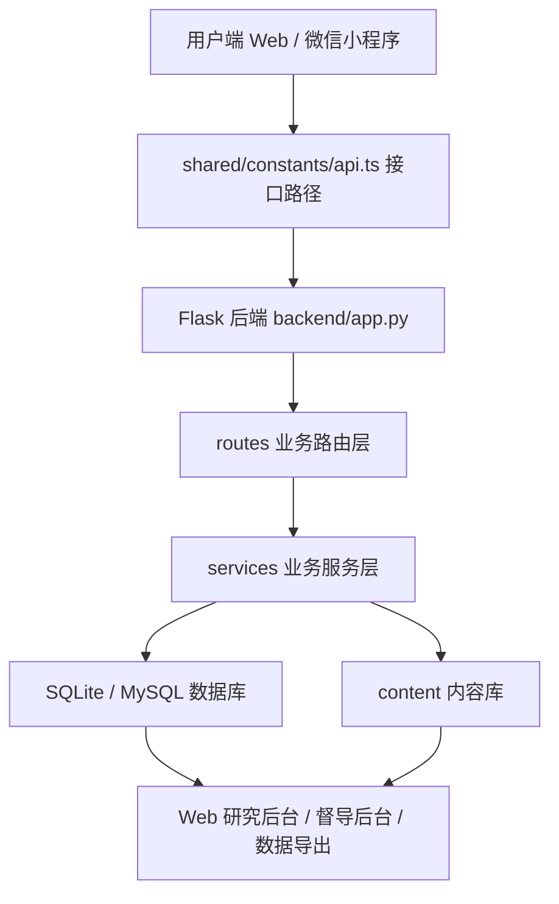

# 当前项目代码总体解释与功能衔接说明

> 项目：`safehome1.0 / 安心陪伴 / ReadFeedback / 安心家平台`  
> 文档用途：面向导师、合作者、后续开发者和 Codex，解释当前项目做什么、代码如何组织、功能如何衔接、数据如何流转、权限和伦理边界如何落实。  
> 当前状态：本文档按当前仓库代码解释，不按早期设想解释；后续代码若继续变更，应同步更新本文档。  

---

## 0. 文档总说明

### 0.1 文档定位

这份文档不是普通 README，也不是开发任务清单，而是项目全景说明书。它主要回答以下问题：

```text
1. 这个项目的心理学和产品定位是什么？
2. 当前代码已经做到哪一步？
3. 后端、Web 前端、小程序、shared、content、docs 之间如何衔接？
4. 用户从进入系统到生成反馈、训练、画像、导出，完整链路怎么走？
5. 权限、隐私、风险复核和非诊断边界在代码中如何体现？
6. 后续程序员或 Codex 应该如何接手？
```

### 0.2 阅读对象

```text
1. 导师：看项目逻辑、研究价值、伦理边界和试点可行性。
2. 合作者：看用户路径、角色分工、试点运行方式。
3. 程序员：看目录结构、接口、数据库、模块衔接。
4. Codex：看后续自动化开发的上下文和禁止事项。
5. 项目负责人：用于汇报、交接、答辩、论文或课题材料整理。
```

### 0.3 当前代码状态概述

当前项目已经不是早期 demo，而是一个包含多端入口、多模块后端、数据库持久化、内容库、风险复核、隐私中心和研究导出的综合系统。后端入口 `backend/app.py` 当前已经注册认证、目标、日记、反馈、家庭绑定、学生画像、家长测评、训练卡、打卡、知情同意、隐私、风险复核、周报、督导和后台导出等蓝图。

---

# 第一部分：项目总体解释

## 1. 项目背景与总体定位

### 1.1 项目名称

```text
安心陪伴 / SafeHome / ReadFeedback / 安心家平台
```

### 1.2 一句话解释

```text
这是一个面向家长和学生的非诊断心理支持系统，通过情绪事件记录、规则化支持性反馈、训练卡练习、学生阶段性画像、风险复核和研究后台导出，帮助家长在亲子互动中形成更稳定、更可练习的陪伴方式。
```

### 1.3 项目不是什么

为避免误解，项目边界必须明确：

```text
1. 不是临床诊断系统。
2. 不是心理咨询系统。
3. 不是危机干预热线。
4. 不是学生人格评定系统。
5. 不是自由大模型聊天系统。
6. 不是单纯测评网站。
7. 不是对家长或学生做价值评判的系统。
```

### 1.4 项目核心目标

```text
1. 帮助家长记录具体亲子互动事件。
2. 帮助家长识别自己的情绪、自动想法和行为反应。
3. 提供非诊断、非评判、支持性反馈。
4. 推荐可以实际完成的小训练卡。
5. 通过打卡和周报形成持续复盘。
6. 为学生端提供阶段性压力反应画像。
7. 对高风险内容进入人工复核，而不是继续普通反馈。
8. 为研究者提供脱敏、可导出的研究数据。
```

---

## 2. 心理学与产品逻辑

### 2.1 心理学基础

项目围绕以下心理学逻辑展开：

```text
1. 家长情绪调节：关注家长在亲子冲突中的情绪、想法和行为。
2. 亲子互动模式：把问题放回具体情境，而不是评价人格。
3. UP 跨诊断情绪调节框架：强调情绪觉察、认知灵活性、行为练习和复盘。
4. 支持性反馈：帮助用户理解发生了什么，而不是给诊断结论。
5. 非评判表达：避免“你做错了”“孩子有问题”等归因式语言。
6. 自我觉察—行为练习—复盘强化：把一次记录转化为一个可练习动作。
```

### 2.2 为什么系统不做诊断

```text
1. 用户输入只是一次情境记录，不等于临床评估。
2. 量表和文本只能作为支持线索，不能替代专业访谈。
3. 自动系统不能判断疾病、人格或家庭病理。
4. 高风险内容不能继续普通训练卡，而应进入人工复核或提示线下支持。
```

### 2.3 核心闭环

```text
目标设定
    ↓
情绪事件记录
    ↓
风险预检
    ↓
非诊断支持性反馈
    ↓
训练卡推荐
    ↓
练习打卡
    ↓
周报复盘
    ↓
人工督导 / 研究后台 / 数据导出
```

### 2.4 家长端、学生端、研究后台、督导后台的关系

```text
家长端：关注家长情绪、亲子回应、训练卡练习和家长测评。
学生端：关注学生阶段性压力反应画像、支持性解释和推荐任务。
研究后台：关注脱敏数据、画像结果、训练卡完成、导出和 codebook。
督导后台：关注风险复核、人工支持请求和处置记录。
管理员：关注系统配置、高级导出、联调测试和安全边界。
```

---

# 第二部分：系统总体架构

## 3. 项目代码目录总览

```text
backend/             Flask 后端，负责 API、数据库、业务逻辑、导出和健康检查。
apps/web/            React Web 前端，包含用户端页面和研究/督导后台。
apps/miniprogram/    微信小程序端，面向真实用户的轻量交互入口。
shared/              前后端共享常量、API 路径、风险等级、导出类型和伦理文案。
content/             训练卡、反馈规则、风险关键词、学生画像模型等内容库。
docs/                开发文档、问题清单、验收记录、交接说明和研究说明。
```

## 4. 总体技术架构



### 4.1 架构分层

```text
第一层：用户界面层，包括 Web 和小程序。
第二层：API 调用层，通过 shared/constants/api.ts 和小程序 services/api.js 统一接口路径。
第三层：后端路由层，即 backend/routes/*.py。
第四层：业务服务层，即 backend/services/*.py。
第五层：数据库与内容库，包括 SQLite/MySQL 和 content/*.json。
第六层：后台管理、督导复核和研究导出。
```

### 4.2 为什么这样设计

```text
1. Web、小程序和后台可以复用同一套后端 API。
2. 训练卡、反馈规则、风险关键词和学生画像模型放在 content，便于内容审核和版本管理。
3. 当前默认可使用 SQLite，后端 database.py 同时保留 MySQL 兼容适配，为后续部署扩展留出口。
4. records 表支持跨模块研究摘要，audit_logs 支持敏感操作留痕。
5. risk_review_records 和 supervision_requests 支持高风险内容和人工督导闭环。
```

---

# 第三部分：后端代码解释

## 5. 后端入口：backend/app.py

### 5.1 create_app() 的作用

`create_app()` 是 Flask 应用工厂，负责：

```text
1. 调用 Config.validate() 校验配置。
2. 创建 Flask app。
3. 初始化数据库 init_db()。
4. 注册所有业务蓝图。
5. 添加 CORS 响应头。
6. 提供 /healthz 和 /healthz/deep 健康检查接口。
```

### 5.2 当前注册的后端蓝图

```text
auth：登录、注册、退出、当前用户。
goals：家长目标设定。
diaries：家长情绪事件记录。
feedback：规则化支持性反馈生成。
family：家长—学生绑定。
profile：学生画像、画像结果、追踪、沙盘、画像复核。
parent_assessments：家长测评与报告。
assessments：通用测评工作表。
cards：训练卡列表和推荐。
checkins：训练卡练习打卡。
consent：知情同意记录。
privacy：隐私中心、授权撤回、删除请求和个人数据摘要。
risk_review：风险复核队列和处置。
reports：周报。
supervision：人工督导请求。
admin：研究导出和后台导出。
```

### 5.3 健康检查

```text
GET /healthz
```

用于判断 Flask 服务是否运行，返回服务名、环境和版本。

```text
GET /healthz/deep
```

用于深度检查数据库和内容文件，适合云托管、部署和联调排查。

### 5.4 内容健康检查

后端要求以下内容文件存在：

```text
training_cards.json
feedback_rules.json
risk_keywords.json
readfeedback/student_profile_model.json
```

如果这些文件缺失，`/healthz/deep` 会反映内容库异常。

---

## 6. 配置、数据库适配与初始化

## 6.1 database.py 的总体作用

`backend/database.py` 负责：

```text
1. 建立数据库连接。
2. 初始化表结构。
3. 同步训练卡内容到数据库。
4. 记录 schema_migrations。
5. 做数据库健康检查。
6. 提供 JSON 序列化、ID 生成、时间戳、审计日志等工具函数。
7. 通过 MySQLConnection 和 mysqlize_schema_statement 兼容 MySQL 部署。
```

### 6.2 SQLite 与 MySQL 兼容

当前项目默认可使用 SQLite，但 `database.py` 已经包含 MySQL 兼容层：

```text
1. DB_PROVIDER=mysql 时使用 PyMySQL。
2. 将 SQLite 风格的 ? 参数转换为 MySQL 的 %s。
3. 将部分 TEXT 字段转换为 VARCHAR 或 LONGTEXT。
4. 对 MySQL 索引字段做类型修正。
```

这说明项目已经开始为正式部署或云数据库迁移做准备，但现阶段仍应优先保证 SQLite 小范围试点稳定。

### 6.3 数据库初始化流程

```text
init_db()
    ↓
执行 SCHEMA_SQL 建表
    ↓
ensure_schema_columns() 兼容旧库新增字段
    ↓
执行 INDEX_SQL 建索引
    ↓
sync_training_cards() 同步训练卡
    ↓
record_schema_migration() 记录当前 schema 版本
```

### 6.4 数据库健康检查

`check_database_health()` 会检查：

```text
1. 数据库 provider。
2. SQLite 路径或 MySQL 信息。
3. 必需表是否存在。
4. schema_migrations 当前版本是否符合预期。
5. training_cards 表与 content/training_cards.json 数量是否同步。
```

---

## 7. 数据库结构解释

## 7.1 当前核心表分组

### A. 用户、身份与家庭绑定

```text
users
family_links
family_bind_rate_limits
consent_records
privacy_requests
```

作用：

```text
users：保存用户基础信息、角色、账号状态和登录字段。
family_links：保存家长—学生绑定关系、绑定码摘要/尾号、状态、过期、锁定和撤销信息，不保存完整绑定码。
family_bind_rate_limits：保存账号、设备、IP 和绑定码四个维度的不可逆摘要与窗口计数。
consent_records：保存知情同意、隐私政策、非诊断声明、研究授权等记录。
privacy_requests：保存删除数据等隐私请求。
```

### B. 家长主流程

```text
goals
emotion_diaries
feedback_results
training_cards
checkins
weekly_reports
```

对应业务链路：

```text
目标设定 -> 情绪记录 -> 支持性反馈 -> 训练卡 -> 打卡 -> 周报
```

### C. 学生画像与学生端

```text
assessment_results
student_profiles
student_profile_followups
student_sandplay_entries
profile_reviews
```

其中 `student_profiles` 是学生画像核心表，保存：

```text
profile_code
profile_name
confidence
dimensions_json
recommended_task_ids_json
risk_level
requires_review
rules_version
model_version
model_type
cluster_id
pc1
pc2
report_json
visuals_json
export_allowed
data_quality
```

这些字段说明学生画像已经具备模型版本、置信度、风险等级、可视化数据、导出控制和人工复核线索。

### D. 研究、审计与迁移

```text
records
audit_logs
schema_migrations
```

作用：

```text
records：统一研究摘要，不替代原始业务表。
audit_logs：记录导出、查看、复核、隐私撤回、家庭绑定等敏感操作。
schema_migrations：记录当前数据库 schema 版本。
```

### E. 风险复核与人工督导

```text
risk_review_records
supervision_requests
```

作用：

```text
risk_review_records：保存风险来源、风险等级、命中类别、复核状态、复核备注和处置结果。
supervision_requests：保存用户提交的人工督导请求、联系方式、风险提示和督导回复。
```

## 7.2 索引设计说明

当前索引主要服务以下查询：

```text
1. 按 user_id 和 created_at 查询日记、反馈、画像。
2. 按 risk_level 和 created_at 查询高风险画像。
3. 按 review_status 和 created_at 查询风险复核队列。
4. 按 action 和 created_at 查询审计日志。
5. 按 module_type 和 created_at 查询 records。
6. 按 bind_code 和 status 查询家庭绑定码。
```

---

# 第四部分：认证、权限、隐私与家庭绑定

## 8. 正式账号与认证系统

### 8.1 auth.py 当前能力

当前认证接口包括：

```text
POST /api/auth/register
POST /api/auth/login
POST /api/auth/logout
GET  /api/auth/me
```

注册接口会校验用户名、密码长度和角色，公开注册目前只允许 `parent` 和 `student`。密码使用 Werkzeug 的 `generate_password_hash()` 存储，不保存明文密码。登录时使用 `check_password_hash()` 验证密码。

### 8.2 auth_utils.py 当前能力

认证工具提供：

```text
generate_auth_token()
verify_auth_token()
get_current_actor()
require_login()
require_role()
role_required()
auth_error_response()
```

token 使用 itsdangerous 的 `URLSafeTimedSerializer` 签名，有效期为 7 天。`get_current_actor()` 同时兼容 Authorization Bearer token 和旧的 `X-Admin-Token`。

### 8.3 当前角色

```text
parent
student
researcher
supervisor
admin
```

公开注册只支持家长和学生；研究者、督导和管理员不应开放注册，应通过受控方式创建。

---

## 9. 家庭绑定系统

### 9.1 family.py 当前能力

接口包括：

```text
POST /api/family/create-bind-code
POST /api/family/bind-student
GET  /api/family/members
DELETE /api/family/unbind
```

### 9.2 绑定流程

```text
家长登录
    ↓
生成 10 位安全随机绑定码
    ↓
family_links 只写入摘要和尾号，状态为 pending
    ↓
学生登录
    ↓
输入绑定码
    ↓
单事务原子兑换，状态变为 consumed
    ↓
写入 parent_view_student_summary 授权记录
    ↓
双方可查询绑定关系
```

### 9.3 绑定安全规则

```text
1. 绑定码为 10 位安全随机数字，完整值只在创建响应中返回一次。
2. 数据库只保存 HMAC 摘要、尾号和脱敏占位值；日志与错误响应不记录完整绑定码。
3. 绑定码 24 小时有效，单码、账号、设备和 IP 均按 15 分钟窗口限流；单码超过 5 次会暂时锁定。
4. 家长只能生成绑定码，不能单方面完成绑定。
5. 学生必须确认绑定。
6. 兑换使用状态、版本、有效期和锁定条件更新，只有一个并发请求可从 `pending` 进入 `consumed`。
7. 重新生成和解绑会将旧关系改为 `revoked`；过期码为 `expired`，临时锁定码为 `locked`。
8. 未满 14 周岁绑定仍需独立的监护人同意和学生本人确认，绑定本身不等于 Consent。
9. 家长默认只查看授权摘要，不查看学生自由文本原文。
10. 生成、绑定、解绑都会写 audit_logs。
```

---

## 10. 隐私中心与授权撤回

### 10.1 privacy.py 当前能力

接口包括：

```text
GET  /api/privacy/consent-status
POST /api/privacy/revoke-consent
POST /api/privacy/delete-my-data
GET  /api/privacy/export-my-data
```

### 10.2 隐私流程

```text
查看授权状态
    ↓
撤回匿名研究授权或研究授权
    ↓
写入 consent_records agreed=0
    ↓
导出层通过 research_revoked_filter 排除撤回用户
```

```text
请求删除数据
    ↓
生成 privacy_requests
    ↓
状态为 pending
    ↓
写入 audit_logs
```

```text
导出个人数据摘要
    ↓
返回各模块数量、授权状态、隐私请求记录
    ↓
不包含自由文本原文、联系方式、审计 metadata 或风险处置私密备注
```

### 10.3 隐私边界

```text
1. 撤回研究授权后，不应继续进入研究导出。
2. 删除数据当前采用请求记录，不直接无审计硬删除。
3. 个人数据摘要默认不返回自由文本原文。
4. 生产环境隐私中心必须登录。
5. 开发环境可兼容匿名试用。
```

---

# 第五部分：API 与共享常量

## 11. shared/constants/api.ts 的作用

`shared/constants/api.ts` 是 Web 前端、文档和后端接口之间的重要统一入口，集中维护：

```text
1. API_ENDPOINTS
2. GOAL_STATUSES
3. RISK_LEVELS
4. SUPERVISION_STATUSES
5. FEEDBACK_TAGS
6. COMMON_PARENT_SCENES
7. COMMON_PARENT_EMOTIONS
8. ADMIN_EXPORT_TYPES
9. ETHICS_COPY
```

### 11.1 API 分组

#### 家长端

```text
/api/goals
/api/diaries
/api/feedback/generate
/api/cards
/api/cards/recommend
/api/checkins
/api/weekly-report
/api/parent-assessment
/api/parent-assessments
```

#### 学生端

```text
/api/student-assessment
/api/profile
/api/profile-results
/api/model/info
/api/risk/check
```

#### 认证、家庭、隐私

```text
/api/auth/register
/api/auth/login
/api/auth/logout
/api/auth/me
/api/family/create-bind-code
/api/family/bind-student
/api/family/members
/api/family/unbind
/api/privacy/consent-status
/api/privacy/revoke-consent
/api/privacy/delete-my-data
/api/privacy/export-my-data
```

#### 后台与研究

```text
/api/risk-review
/api/supervision
/api/admin/export
```

### 11.2 伦理文案

`ETHICS_COPY` 包含：

```text
nonDiagnostic：反馈仅用于自我理解和亲子沟通练习，不构成临床诊断。
supportiveBoundary：反馈聚焦具体场景、情绪和可练习动作，不评价人格。
highRisk：高风险时优先联系线下专业人员或紧急支持。
```

---

# 第六部分：Web 前端解释

## 12. Web 总体结构

`apps/web/src/main.tsx` 负责：

```text
1. 引入所有页面组件。
2. 根据 window.location.pathname 判断当前页面。
3. 渲染公共页面、家长端页面、学生端页面和后台页面。
4. 定义后台导航菜单。
5. 根据 getStoredAuthUser() 的 role 过滤可见菜单。
```

### 12.1 页面分组

#### 公共页面

```text
/
/about-study
/login
/register
/privacy
```

#### 家长端

```text
/assessment
/assessment/report/...
/family
```

#### 学生端

```text
/student
/student/assessment
/student/report/...
/family
```

#### 研究后台

```text
/dashboard
/diaries
/feedback
/checkins
/reports
/profiles
/goals
/content/cards
/content/rules
/export
```

#### 督导后台

```text
/supervision
/reviews
```

#### 调试页面

```text
/integration-test
```

### 12.2 后台菜单角色过滤

后台菜单中已经配置角色可见性，例如：

```text
/dashboard：admin、researcher、supervisor
/diaries：admin、researcher
/supervision：admin、supervisor
/reviews：admin、supervisor
/export：admin、researcher
/family：parent、student
/integration-test：admin
```

注意：前端菜单过滤只是体验优化，真正的数据保护必须由后端接口权限完成。

---

# 第七部分：微信小程序解释

## 13. 小程序总体结构

`apps/miniprogram/app.json` 当前注册了以下页面：

```text
pages/home/index
pages/training/index
pages/course/index
pages/profile/index
pages/goal-setting/index
pages/diary-form/index
pages/feedback-result/index
pages/assessment/index
pages/assessment-detail/index
pages/assessment-result/index
pages/hot-topics/index
pages/task-detail/index
pages/training-card/index
pages/checkin/index
pages/weekly-report/index
pages/supervision/index
pages/debug/index
pages/integration-test/index
```

### 13.1 小程序主流程

```text
首页
    ↓
目标设定
    ↓
情绪事件记录
    ↓
即时反馈
    ↓
训练卡推荐
    ↓
训练卡详情
    ↓
练习打卡
    ↓
周报复盘
    ↓
人工督导请求
```

### 13.2 小程序 API 封装

`apps/miniprogram/services/api.js` 使用：

```text
wx.cloud.callContainer
```

并统一注入匿名 user_id。请求失败时会返回包含云环境 ID、服务名、路径和方法的 debug 信息，便于排查 CloudBase 云托管问题。

### 13.3 小程序与 Web 的差异

```text
小程序：更接近真实用户使用，强调轻量、低负担和移动端交互。
Web：既包含用户端页面，也包含研究后台、督导后台、导出和联调测试。
shared：负责让 Web、小程序和后端接口尽量保持一致。
```

---

# 第八部分：内容库与规则系统

## 14. content 内容库

核心文件：

```text
content/training_cards.json
content/feedback_rules.json
content/risk_keywords.json
content/readfeedback/student_profile_model.json
```

### 14.1 训练卡系统

训练卡从 content 同步到数据库 `training_cards` 表。训练卡字段包括：

```text
id
type
title
purpose
steps_json
tags_json
example
duration_minutes
enabled
version
```

训练卡流转：

```text
反馈生成 recommended_card_ids
    ↓
前端展示训练卡
    ↓
用户完成练习
    ↓
checkins 记录 emotion_before / emotion_after / reflection
    ↓
周报统计
    ↓
研究后台导出
```

### 14.2 反馈规则系统

反馈不是自由大模型问答，而是基于：

```text
1. 用户输入字段。
2. 风险预检结果。
3. 规则化 feedback_service。
4. 推荐训练卡 ID。
5. 非诊断模板和支持性语言。
```

### 14.3 风险关键词系统

风险关键词用于判断自由文本是否适合继续自动反馈。

```text
低风险：继续普通反馈。
中风险：谨慎反馈，可进入复核。
高风险：中止普通反馈，进入人工复核。
```

### 14.4 学生画像模型文件

`content/readfeedback/student_profile_model.json` 是学生画像模型依赖文件，后端健康检查会确认它存在。画像输出必须被理解为阶段性支持线索，而不是人格或诊断结论。

---

# 第九部分：核心功能链路详解

## 15. 家长主流程：目标—记录—反馈—训练—打卡—周报

```text
用户操作：设置目标、填写情绪记录、查看反馈、练习训练卡、打卡、看周报。
前端入口：小程序主流程；Web 后台可查看记录、反馈、打卡和周报。
接口：/api/goals、/api/diaries、/api/feedback/generate、/api/cards、/api/checkins、/api/weekly-report。
数据表：goals、emotion_diaries、feedback_results、training_cards、checkins、weekly_reports、records。
```

### 15.1 情绪记录到反馈

```text
emotion_diaries 保存具体事件。
feedback.py 根据 diary_id 读取记录。
require_admin_or_owner() 校验访问权限。
check_text_risk() 做风险预检。
低/中风险调用 generate_feedback()。
高风险返回安全边界提示，不继续普通训练卡推荐。
feedback_results 保存反馈结果。
risk_review_records 记录风险复核线索。
```

## 16. 学生画像流程

```text
学生填写测评
    ↓
POST /api/profile
    ↓
generate_student_profile()
    ↓
assessment_results 保存测评结果
    ↓
student_profiles 保存画像结果
    ↓
records 写入 student_profile 摘要
    ↓
check_text_risk() 检查自由文本
    ↓
risk_review_records 写入复核记录
    ↓
学生端报告 / 后台画像管理 / 研究导出
```

学生画像关键字段：

```text
profile_code
profile_name
confidence
dimensions
recommended_card_ids
risk_level
requires_review
rules_version
model_version
model_type
cluster_id
pc1
pc2
report
visuals
export_allowed
data_quality
```

### 16.1 画像边界

```text
1. 画像是阶段性支持线索，不是诊断。
2. 不应解释为人格类型。
3. 不应自动解释潜意识。
4. 低置信度时应弱化展示。
5. 高风险时进入人工复核。
```

## 17. 学生追踪和沙盘表达

学生画像后续支持：

```text
/profile-results/<profile_id>/followups
/profile-results/<profile_id>/sandplay
/profile-results/<profile_id>/visuals
```

追踪反馈会写入 `student_profile_followups` 和 `records`；沙盘表达会写入 `student_sandplay_entries` 和 `records`。沙盘内容只作为表达线索，不做潜意识解释。

## 18. 家长测评流程

```text
家长填写测评
    ↓
parent_assessment_submissions
    ↓
生成 report_json
    ↓
家长报告页展示
    ↓
parent_report_actions 记录报告动作
    ↓
研究导出 raw_wide / long / codebook
```

研究字段包括：

```text
anonymous_id
participant_code
research_consent
study_batch
source_channel
questionnaire_version
scoring_version
answers_json
scores_json
report_json
duration_seconds
quality_flags_json
export_allowed
```

## 19. 高风险复核流程

```text
自由文本输入
    ↓
check_text_risk()
    ↓
allow_auto_feedback = false
    ↓
普通反馈中止
    ↓
risk_review_records
    ↓
/reviews 或 /supervision
    ↓
人工复核、督导处置、关闭或继续跟进
```

风险复核不是诊断或危机干预，而是安全边界和人工关注入口。

## 20. 研究导出流程

```text
研究者或管理员进入 /export
    ↓
GET /api/admin/export?type=...
    ↓
require_role(admin, researcher)
    ↓
researcher 仅可访问脱敏研究导出类型
    ↓
过滤 export_allowed = 1
    ↓
过滤已撤回研究授权用户
    ↓
高风险画像或 records 需要 confirm_high_risk=true
    ↓
转换为脱敏 CSV
    ↓
写 audit_logs
```

导出原则：

```text
1. 默认脱敏。
2. 导出文本长度或摘要，不默认导出自由文本原文。
3. participant_code 使用哈希。
4. 研究撤回用户被过滤。
5. 高风险导出需要二次确认。
6. 所有导出写 audit_logs。
```

---

# 第十部分：权限、伦理与安全

## 21. 角色权限矩阵

| 角色 | 可访问内容 | 不应访问内容 |
|---|---|---|
| parent | 自己的记录、反馈、训练卡、家长测评、家庭绑定 | 研究后台、他人数据、学生原始文本 |
| student | 自己的测评、画像报告、绑定确认 | 家长后台、研究导出 |
| researcher | 脱敏研究数据、模型结果、规则、导出 | 真实身份、高风险原始文本 |
| supervisor | 风险复核、督导请求、处置记录 | 全量研究导出 |
| admin | 系统配置、高级导出、联调测试 | 不应无理由查看敏感文本 |

## 22. 前端权限和后端权限区别

```text
前端菜单过滤只是体验优化，不能防止接口被直接访问。
后端 require_login、require_role、require_admin_or_owner、require_admin_token 才是真正的数据保护。
```

## 23. 审计日志

`audit_logs` 用于记录敏感操作，包括：

```text
1. 研究导出。
2. 查看画像详情。
3. 保存人工复核。
4. 家庭绑定、解绑。
5. 撤回授权。
6. 删除数据请求。
```

## 24. 伦理边界

### 24.1 非诊断边界

```text
本系统反馈仅用于自我理解和亲子沟通练习，不构成临床诊断。
```

### 24.2 家长端边界

```text
1. 不评价家长好坏。
2. 不归因孩子问题。
3. 不制造内疚感。
4. 不使用考核化语言。
5. 强调具体场景和可练习动作。
```

### 24.3 学生端边界

```text
1. 不使用人格标签。
2. 不把画像固定化。
3. 不解释潜意识。
4. 不把沙盘表达自动诊断化。
5. 强调阶段性线索和支持性建议。
```

### 24.4 风险边界

```text
1. 高风险时中止普通反馈。
2. 高风险时不继续普通训练卡推荐。
3. 高风险内容进入 risk_review_records。
4. 系统不替代线下专业人员或紧急支持。
```

---

# 第十一部分：测试、联调与部署

## 25. 本地运行说明

### 25.1 后端

```bash
cd backend
python app.py
```

### 25.2 Web 前端

```bash
cd apps/web
npm install
npm run dev
```

### 25.3 小程序

```text
使用微信开发者工具打开 apps/miniprogram。
检查 app.json 页面注册。
检查云托管环境 ID 和服务名。
通过 pages/integration-test/index 或 pages/debug/index 联调。
```

## 26. 健康检查与故障排查

```text
GET /healthz：确认服务是否启动。
GET /healthz/deep：确认数据库、schema、训练卡同步和内容库是否正常。
```

常见问题：

```text
1. 后端启动失败。
2. 内容文件缺失。
3. 数据库路径错误。
4. CORS 错误。
5. Authorization 缺失。
6. X-Admin-Token 错误。
7. 小程序 callContainer 失败。
8. 前端 build 失败。
9. MySQL 部署字段类型或索引问题。
```

## 27. 测试重点

```text
1. 注册登录。
2. 角色权限。
3. 日记提交。
4. 反馈生成。
5. 高风险阻断。
6. 学生画像生成。
7. 家庭绑定。
8. 隐私撤回。
9. 导出脱敏。
10. 小程序主流程。
11. Web 后台主流程。
12. 内容 JSON 校验。
```

---

# 第十二部分：研究与试点衔接

## 28. 可用于研究的数据

```text
1. 家长情绪记录。
2. 支持性反馈结果。
3. 训练卡推荐与打卡。
4. 家长测评结果。
5. 学生画像结果。
6. 学生追踪反馈。
7. 沙盘表达摘要。
8. 周报数据。
9. 风险复核状态。
10. 家庭绑定关系。
```

## 29. 不应直接用于研究导出的数据

```text
1. 真实姓名。
2. 联系方式。
3. openid。
4. 原始高风险文本。
5. 未授权自由文本。
6. 撤回研究授权后的用户数据。
7. 后台审计 metadata 中可能包含的敏感上下文。
```

## 30. 试点运行建议

```text
家长：完成目标设定、情绪记录、反馈查看、训练卡练习和周报查看。
学生：完成学生测评、查看阶段性画像、完成推荐任务或追踪反馈。
研究者：查看脱敏数据、导出 raw_wide / long / codebook。
督导：处理风险复核和人工支持请求。
管理员：负责账号、配置、导出和联调问题。
```

试点指标建议：

```text
记录完成率
反馈查看率
训练卡点击率
训练卡完成率
周报查看率
画像完成率
风险触发率
风险复核处理时长
导出数据完整性
用户理解度和负担感
```

---

# 第十三部分：项目维护与 Codex 接手说明

## 31. 后续开发必须先读的文件

```text
AGENTS.md
docs/项目进度统一口径.md
docs/开发说明.md
docs/开发日志.md
docs/6.5技术难点处理逐步开发清单.md
backend/app.py
backend/models.py
backend/database.py
shared/constants/api.ts
apps/web/src/main.tsx
apps/miniprogram/services/api.js
```

## 32. 不允许随意改动的内容

```text
1. 匿名 ID 逻辑。
2. 风险复核逻辑。
3. 非诊断文案。
4. 导出脱敏逻辑。
5. audit_logs。
6. records。
7. student_profiles。
8. family_links。
9. consent_records。
10. privacy_requests。
```

## 33. 优先通过 content 修改的内容

```text
训练卡
反馈规则
风险关键词
伦理文案
画像解释文本
```

## 34. 每次开发后的汇报格式

```text
1. 修改文件。
2. 新增文件。
3. 新增或修改接口。
4. 数据库变更。
5. 本地测试。
6. 未完成问题。
7. 下一步建议。
```

---

# 第十四部分：当前完成度与后续重点

## 35. 当前已经完成的能力

```text
1. Flask 多蓝图后端。
2. SQLite 核心数据库，并预留 MySQL 兼容。
3. Web 用户端和研究/督导后台。
4. 小程序主流程。
5. 家长目标、日记、反馈、训练卡、打卡、周报闭环。
6. 学生画像和学生报告。
7. 家长测评和研究导出。
8. 风险检查和人工复核。
9. 审计日志。
10. 登录注册初步接入。
11. 家庭绑定初步接入。
12. 隐私中心初步接入。
13. 内容健康检查。
14. 数据库深度健康检查。
15. 研究导出脱敏和授权撤回过滤。
```

## 36. 当前仍需重点核查的内容

```text
1. 所有敏感接口是否都已从 X-Admin-Token 迁移或兼容到角色权限。
2. 前端角色菜单过滤是否和后端 require_role 一致。
3. 高风险自由文本是否覆盖所有入口。
4. records 是否覆盖所有核心业务模块。
5. 导出是否始终默认脱敏。
6. 撤回研究授权后是否排除所有相关研究导出。
7. 家庭绑定是否始终需要学生确认。
8. 家长是否不能默认查看学生原始文本。
9. 学生画像低置信度展示是否足够弱化。
10. 小程序和 Web 字段是否一致。
11. 内容规则是否有版本和审核状态。
12. SQLite / MySQL 两套路径是否都能通过健康检查。
13. 数据库备份恢复流程是否验证。
```

---

# 附录 A：核心文件索引

```text
backend/app.py
backend/config.py
backend/database.py
backend/models.py
backend/routes/auth.py
backend/routes/auth_utils.py
backend/routes/family.py
backend/routes/privacy.py
backend/routes/feedback.py
backend/routes/profile.py
backend/routes/admin.py
backend/routes/risk_review.py
backend/routes/supervision.py
backend/services/risk_service.py
backend/services/feedback_service.py
backend/services/student_profile_model_service.py
apps/web/src/main.tsx
apps/web/src/pages/*.tsx
apps/web/src/services/*.ts
apps/miniprogram/app.json
apps/miniprogram/services/api.js
apps/miniprogram/services/userIdentity.js
shared/constants/api.ts
content/training_cards.json
content/feedback_rules.json
content/risk_keywords.json
content/readfeedback/student_profile_model.json
```

# 附录 B：术语表

```text
非诊断反馈：只用于理解和练习，不构成临床判断。
支持性反馈：强调情绪理解、非评判解释和小步行动。
训练卡：可执行的小练习，不是治疗课程。
阶段性画像：学生当前压力反应线索，不是人格标签。
风险复核：高风险文本进入人工关注，不是危机干预承诺。
人工督导：对用户请求或风险记录进行人工支持和处置记录。
records：跨模块统一研究摘要。
audit_logs：敏感操作留痕。
export_allowed：是否允许进入研究导出。
anonymous_id：脱敏匿名编号。
family_links：家长—学生绑定关系。
consent_records：知情同意与授权记录。
privacy_requests：删除数据等隐私请求记录。
```
