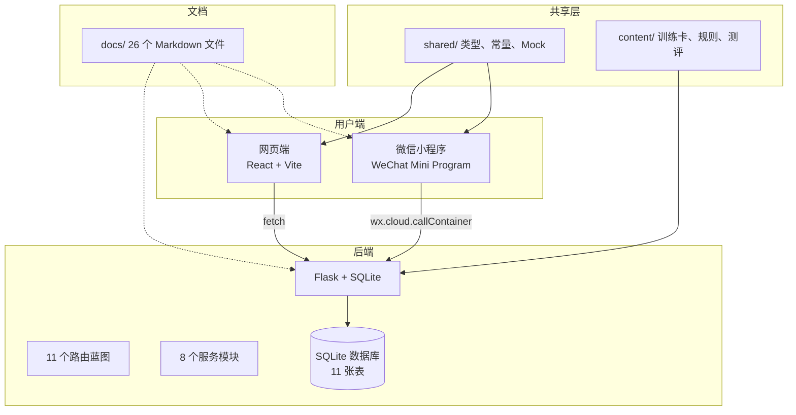
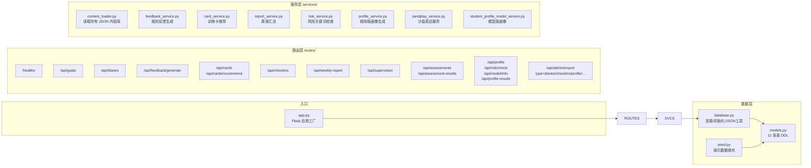
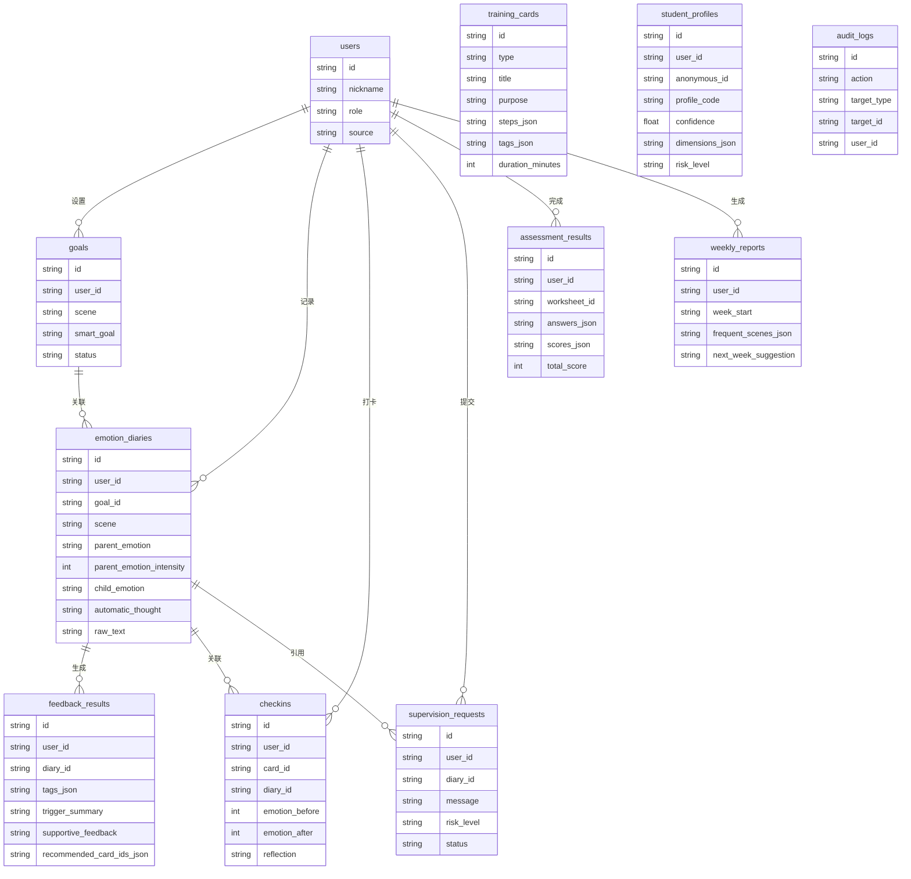
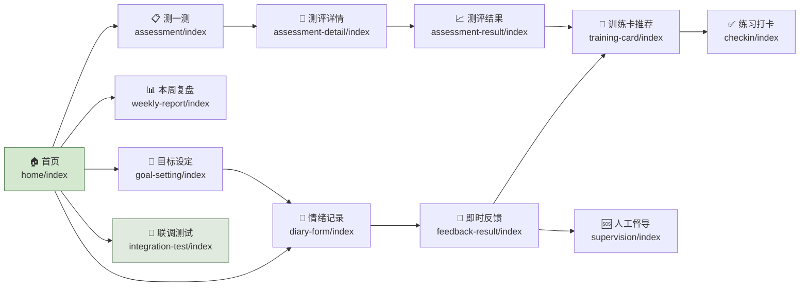
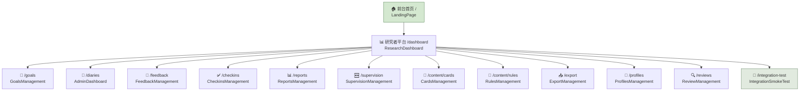
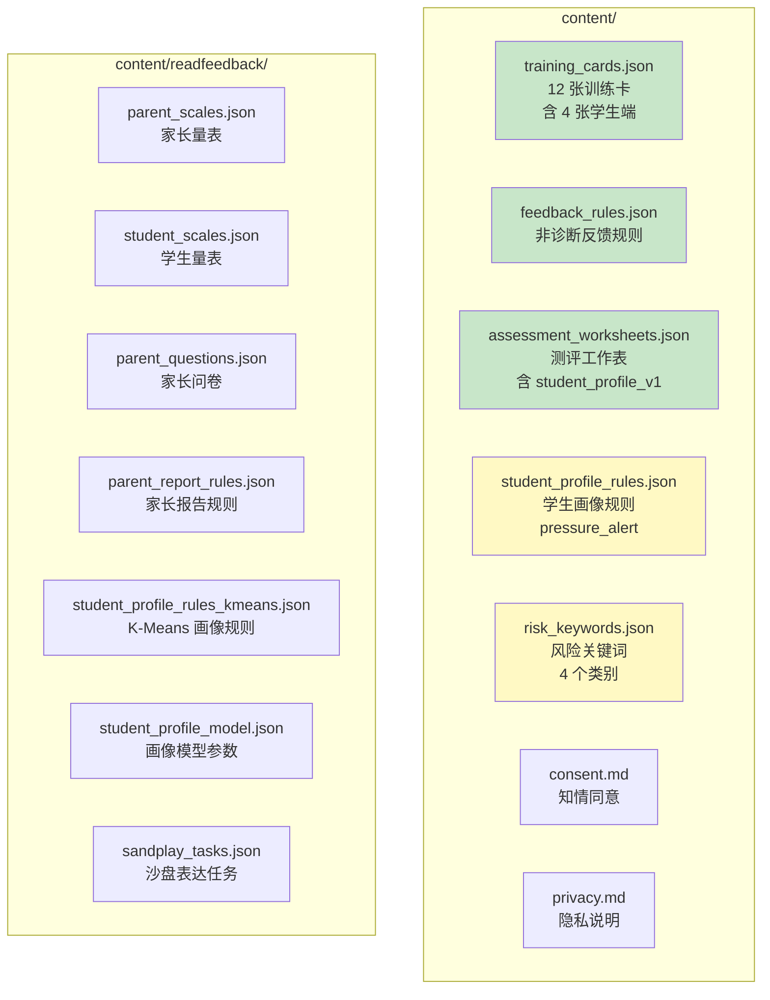
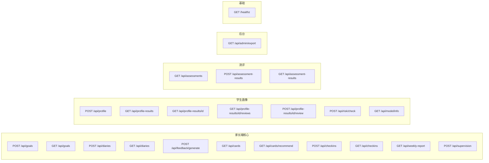

# 项目架构可视化

生成日期：2026-06-02

> VS Code 预览方式：`Ctrl+Shift+V`，或安装 `Markdown Preview Mermaid` 插件后右键 → `Open Preview`。

---

## 1. 项目全景



---

## 2. 后端架构



---

## 3. 数据库表（11 张）



---

## 4. 小程序端页面流程



**18 个页面目录：**

| 页面 | 路径 | 用途 |
|------|------|------|
| home | `pages/home/` | 首页入口 |
| goal-setting | `pages/goal-setting/` | 设定本周小目标 |
| diary-form | `pages/diary-form/` | 情绪事件记录 |
| feedback-result | `pages/feedback-result/` | 即时反馈 + 模式识别卡 |
| training-card | `pages/training-card/` | UP 训练卡推荐与详情 |
| training | `pages/training/` | 训练中心 |
| checkin | `pages/checkin/` | 轻打卡 |
| weekly-report | `pages/weekly-report/` | 简版周度报告 |
| supervision | `pages/supervision/` | 人工督导入口 |
| assessment | `pages/assessment/` | 测一测列表 |
| assessment-detail | `pages/assessment-detail/` | 测评详情/填写 |
| assessment-result | `pages/assessment-result/` | 测评结果/画像报告 |
| profile | `pages/profile/` | 学生画像（独立入口） |
| course | `pages/course/` | 课程（预留） |
| hot-topics | `pages/hot-topics/` | 热门话题（预留） |
| task-detail | `pages/task-detail/` | 任务详情（预留） |
| integration-test | `pages/integration-test/` | 🧪 长期联调测试页 |

---

## 5. 网页端页面



**16 个页面文件：**

| 路由 | 组件 | 用途 |
|------|------|------|
| `/` | `LandingPage` | 家长端网站入口页 |
| `/dashboard` | `ResearchDashboard` | 研究者平台总览 |
| `/goals` | `GoalsManagement` | 目标管理 |
| `/diaries` | `AdminDashboard` | 情绪记录列表和详情 |
| `/feedback` | `FeedbackManagement` | 反馈结果查看 |
| `/checkins` | `CheckinsManagement` | 练习打卡记录 |
| `/reports` | `ReportsManagement` | 周报记录 |
| `/supervision` | `SupervisionManagement` | 督导请求查看 |
| `/content/cards` | `CardsManagement` | 训练卡管理 |
| `/content/rules` | `RulesManagement` | 反馈规则查看 |
| `/export` | `ExportManagement` | 数据导出 |
| `/profiles` | `ProfilesManagement` | 学生画像列表/详情 |
| `/reviews` | `ReviewManagement` | 人工复核列表 |
| `/integration-test` | `IntegrationSmokeTest` | 🧪 联调测试 |
| — | `DeferredAdminPage` | 占位页（未分配路由） |

---

## 6. 内容库结构



---

## 7. API 全景



---

## 8. 开发阶段总览

```mermaid
gantt
    title 开发进度甘特图
    dateFormat YYYY-MM-DD
    axisFormat %m/%d

    section MVP 1.0
    后端 MVP Flask+SQLite     :done, mvp1a, 2026-05-20, 2d
    shared 类型/常量/Mock      :done, mvp1b, 2026-05-20, 1d
    小程序 + Web 联调入口      :done, mvp1c, 2026-05-21, 1d
    MVP 1.0 封版验收          :done, mvp1d, 2026-05-21, 1d

    section MVP 1.1
    目标设定 + 记录升级        :done, mvp11a, 2026-05-21, 1d
    反馈/训练卡/打卡/周报/督导  :done, mvp11b, 2026-05-22, 1d
    Web 后台 11 个页面         :done, mvp11c, 2026-05-22, 1d

    section 学生画像 P0
    内容库 + 文档准备          :done, p0, 2026-05-31, 1d

    section 学生画像 P1
    画像 API + 风险检查        :done, p1, 2026-06-01, 1d

    section 学生画像 P2
    小程序测评链路             :done, p2a, 2026-06-01, 1d
    Web 画像列表/详情/导出     :done, p2b, 2026-06-01, 1d

    section CloudBase
    迁移 + INVALID_HOST 修复   :done, cb, 2026-06-01, 1d

    section 代码审查
    API Bug 修复 + 文档审查    :done, cr, 2026-06-01, 1d

    section 下一步
    试点前人工验收             :active, next, 2026-06-02, 3d
    正式上线                   :future, launch, 2026-06-05, 7d
```

---

## 9. 关键数字

| 维度 | 数量 |
|------|------|
| 后端 Python 文件 | 22 个 |
| 小程序页面 | 18 个（含 3 个预留） |
| Web 页面 | 16 个 |
| API 端点 | 22 个 |
| 数据库表 | 11 张 |
| 服务模块 | 8 个 |
| 内容 JSON 文件 | 11 个 |
| Markdown 文档 | 26 个 |
| 学生画像规则 | 1 条（pressure_alert） |
| 学生端训练卡 | 4 张 |
| 风险关键词类别 | 4 个 |
