# 项目核心流程图

> 项目：`safehome1.0 / 安心陪伴 / ReadFeedback / 安心家平台`  
> 文档用途：集中整理当前项目核心功能链路的 Mermaid 流程图，便于写文档、做 PPT、给导师讲解、给 Codex 或程序员交接。  
> 使用说明：本文档中的 Mermaid 图可以直接复制到支持 Mermaid 的 Markdown 编辑器、GitHub、Typora、Obsidian 或 PPT 转图工具中使用。  

---

## 1. 系统总体架构图

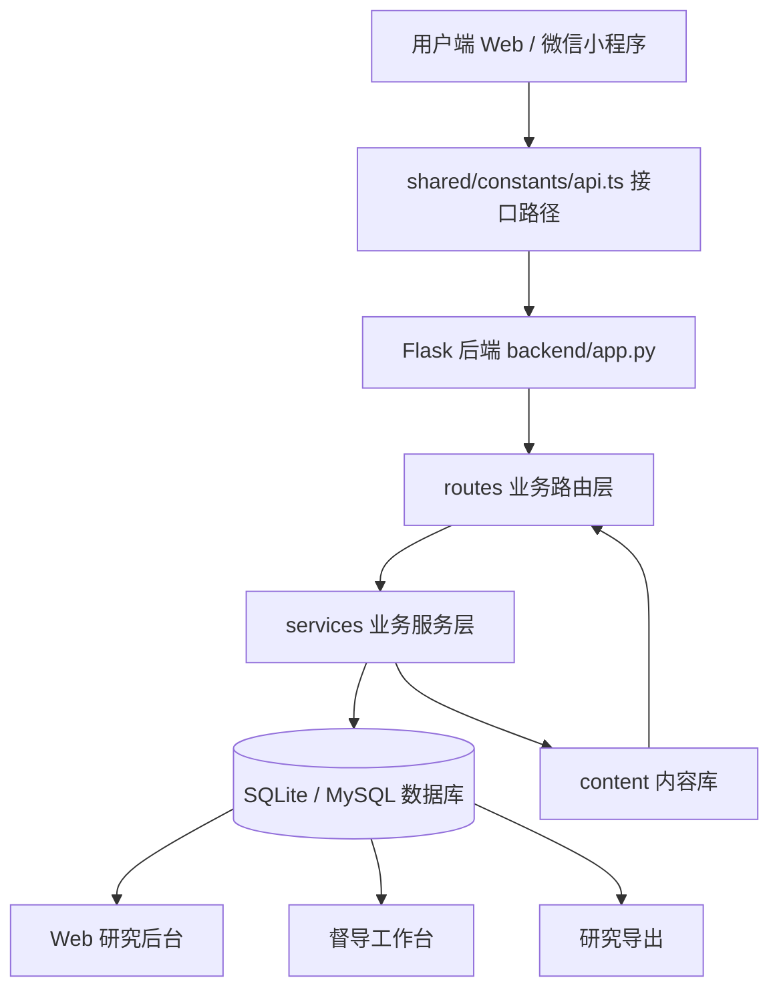

说明：

```text
用户通过 Web 或小程序进入系统；前端根据 shared/constants/api.ts 或小程序 api.js 调用后端；后端由 app.py 统一注册蓝图；routes 调用 services；services 读取数据库和 content 内容库；最终结果流向用户端、研究后台、督导后台和导出模块。
```

---

## 2. 后端应用启动与健康检查流程

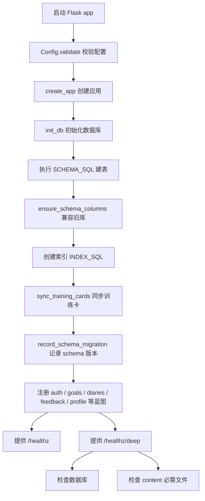

说明：

```text
/healthz 用于轻量探活；/healthz/deep 用于检查数据库、schema、训练卡同步和 content 文件是否完整。
```

---

## 3. 目录与模块关系图

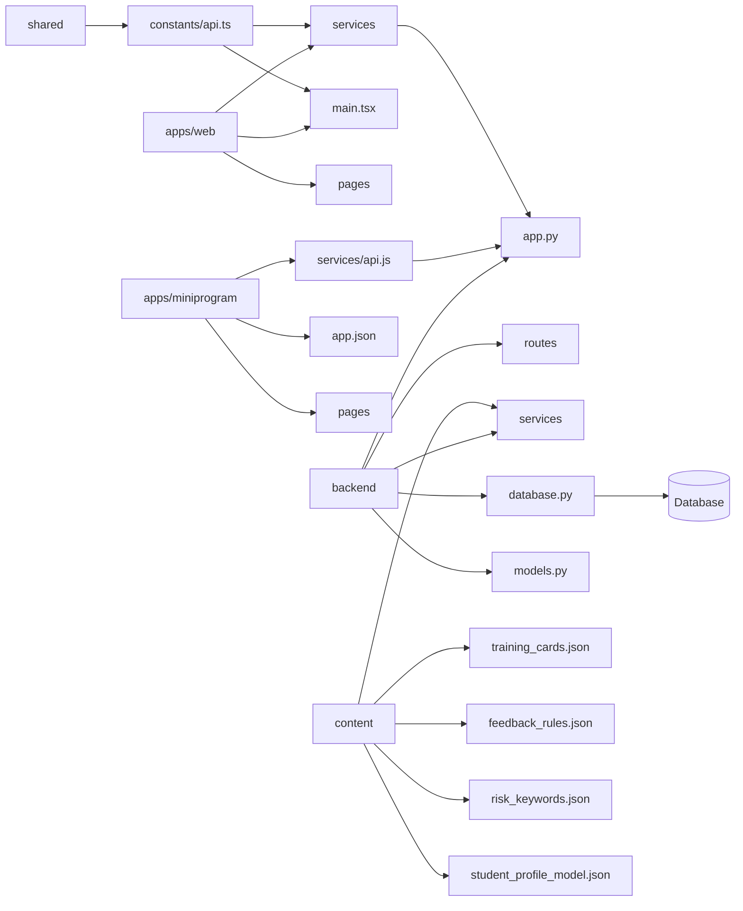

---

## 4. 用户角色与入口图

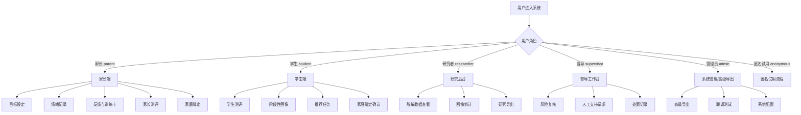

---

## 5. 家长主流程：目标—记录—反馈—训练—周报

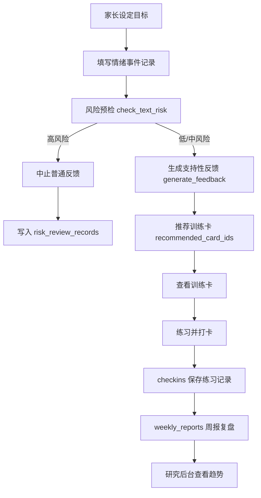

涉及接口：

```text
POST /api/goals
POST /api/diaries
POST /api/feedback/generate
GET  /api/cards
GET  /api/cards/recommend
POST /api/checkins
GET  /api/weekly-report
```

涉及数据表：

```text
goals
emotion_diaries
feedback_results
training_cards
checkins
weekly_reports
records
risk_review_records
audit_logs
```

---

## 6. 支持性反馈生成流程

```mermaid
flowchart TD
    A[前端提交 diary_id 或 payload] --> B[/api/feedback/generate]
    B --> C{是否传入 diary_id}
    C -->|是| D[读取 emotion_diaries]
    C -->|否| E[直接使用 payload]
    D --> F[require_admin_or_owner 权限检查]
    E --> G[提取风险文本字段]
    F --> G
    G --> H[check_text_risk]
    H --> I{allow_auto_feedback?}
    I -->|true| J[generate_feedback 普通支持性反馈]
    I -->|false| K[高风险安全提示]
    J --> L[保存 feedback_results]
    K --> L
    L --> M[create_risk_review_record]
    M --> N[返回反馈结果]
```

关键边界：

```text
高风险时：
1. 不生成普通互动模式反馈。
2. 不推荐普通训练卡。
3. recommended_card_ids 返回空数组。
4. 写入 risk_review_records。
```

---

## 7. 训练卡推荐与打卡流程

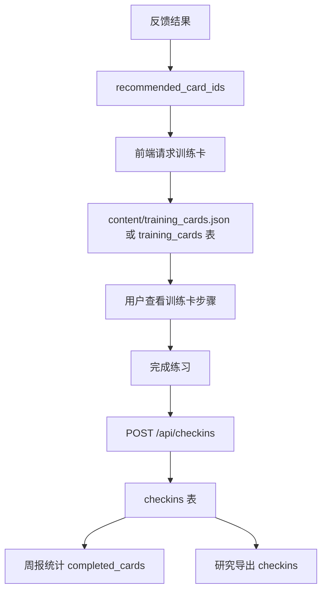

说明：

```text
训练卡是低压力练习，不是课程考试，也不是治疗方案。打卡更强调“尝试”和“复盘”，不应变成考核机制。
```

---

## 8. 学生画像生成流程

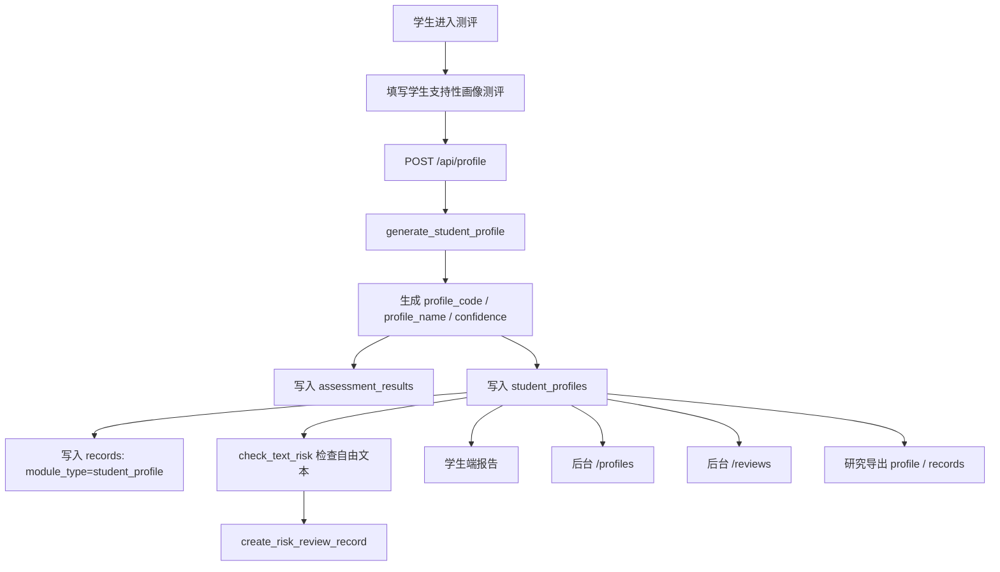

关键字段：

```text
profile_code
profile_name
confidence
risk_level
requires_review
model_version
model_type
rules_version
cluster_id
pc1
pc2
report_json
visuals_json
export_allowed
data_quality
```

边界：

```text
学生画像只能解释为阶段性压力反应线索，不能解释为人格类型或临床诊断。
```

---

## 9. 学生画像后续追踪流程

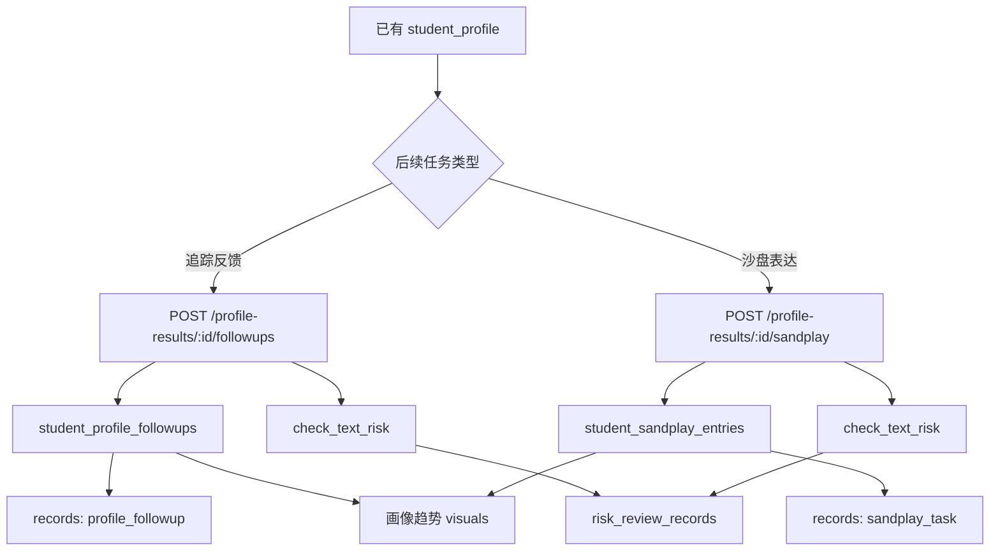

说明：

```text
沙盘表达只作为表达线索和访谈线索，不自动解释潜意识，不做诊断推断。
```

---

## 10. 家长测评流程

```mermaid
flowchart TD
    A[家长进入测评页面] --> B[填写问卷]
    B --> C[POST /api/parent-assessment]
    C --> D[计算 scores_json]
    D --> E[生成 report_json]
    E --> F[parent_assessment_submissions]
    F --> G[家长报告页]
    G --> H[parent_report_actions 记录报告动作]
    F --> I[研究导出 parent_assessments]
    F --> J[raw_wide / long / codebook]
```

研究字段：

```text
participant_code
research_consent
study_batch
source_channel
questionnaire_version
scoring_version
duration_seconds
quality_flags_json
export_allowed
```

---

## 11. 家长—学生绑定流程

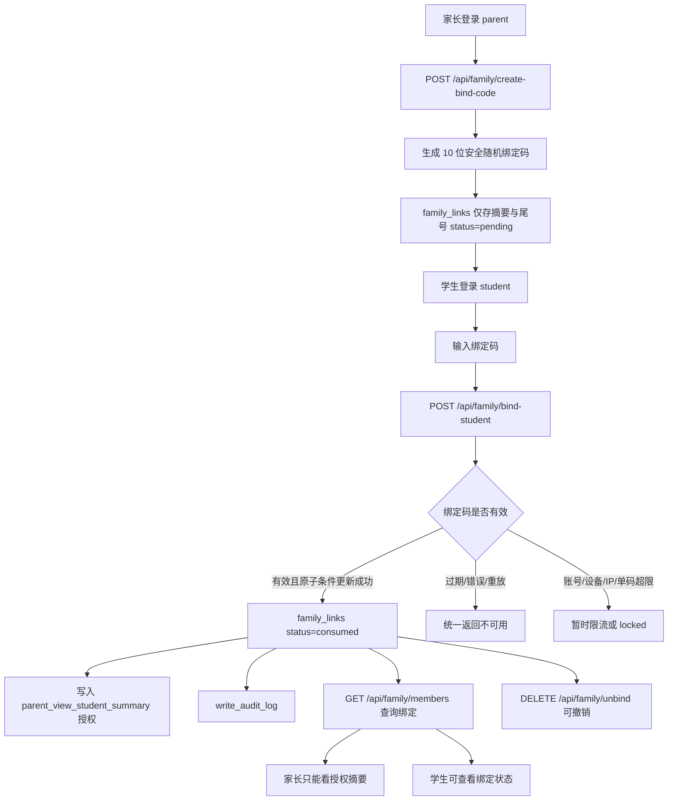

绑定规则：

```text
1. 家长不能单方面完成绑定。
2. 学生必须输入绑定码确认。
3. 绑定码为 10 位安全随机数字，24 小时有效；数据库与日志不保存完整码。
4. 单码超过 5 次以及账号、设备、IP 超限时暂时阻断；生产 Redis 不可用时拒绝兑换。
5. 同一码只允许一个并发请求从 `pending` 原子进入 `consumed`。
6. 绑定不等于研究授权或监护人敏感数据处理同意。
7. 绑定不等于家长可查看学生原始文本。
```

---

## 12. 隐私中心与授权撤回流程

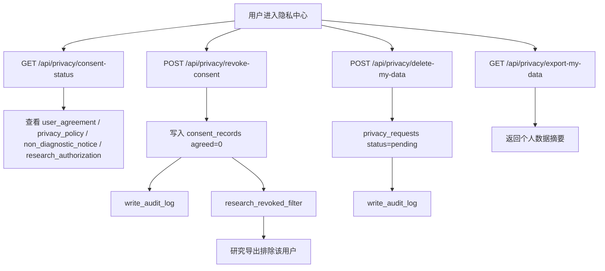

隐私边界：

```text
1. export-my-data 返回摘要，不默认返回自由文本原文。
2. delete-my-data 当前生成删除请求，不做无审计硬删除。
3. revoke-consent 后研究导出应排除该用户。
```

---

## 13. 高风险复核流程

```mermaid
flowchart TD
    A[自由文本输入] --> B[check_text_risk]
    B --> C{风险等级 / allow_auto_feedback}
    C -->|低/中风险且允许自动反馈| D[普通支持性反馈]
    C -->|高风险或不允许自动反馈| E[安全边界提示]
    E --> F[create_risk_review_record]
    F --> G[risk_review_records]
    G --> H[/reviews 人工复核]
    G --> I[/supervision 督导工作台]
    H --> J[更新 review_status]
    I --> J
    J --> K[reviewed / need_followup / closed]
    K --> L[audit_logs 留痕]
```

风险处理边界：

```text
1. 不做诊断。
2. 不承诺治疗。
3. 不继续普通训练卡推荐。
4. 不默认暴露给研究者。
5. 必须进入人工复核或安全提示。
```

---

## 14. 研究导出流程

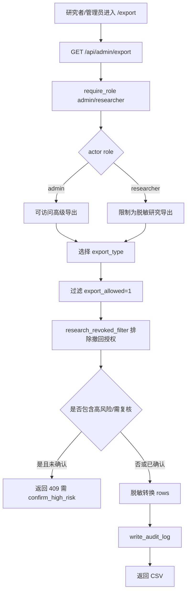

导出类型：

```text
goals
diaries
feedback
checkins
assessments
profile
student_profiles
records
student_followups
sandplay
parent_assessments
raw_wide
long
codebook
reports
supervision
cards
```

导出原则：

```text
1. 默认脱敏。
2. 默认不导出真实身份和联系方式。
3. 自由文本默认转为长度、摘要或结构化字段。
4. 研究撤回用户会被过滤。
5. 高风险或需复核数据需要二次确认。
6. 所有导出写 audit_logs。
```

---

## 15. Web 前端路由结构图

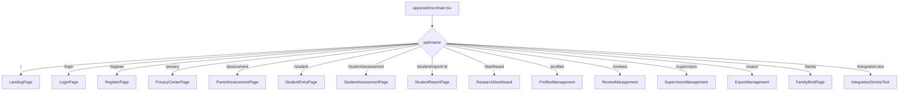

---

## 16. Web 后台菜单角色过滤图

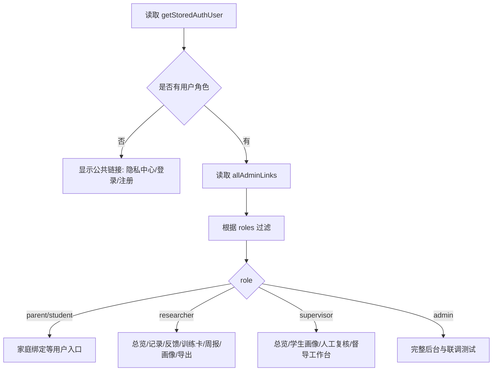

提示：

```text
前端菜单过滤只改善体验，不能代替后端权限校验。
```

---

## 17. 小程序 API 调用流程

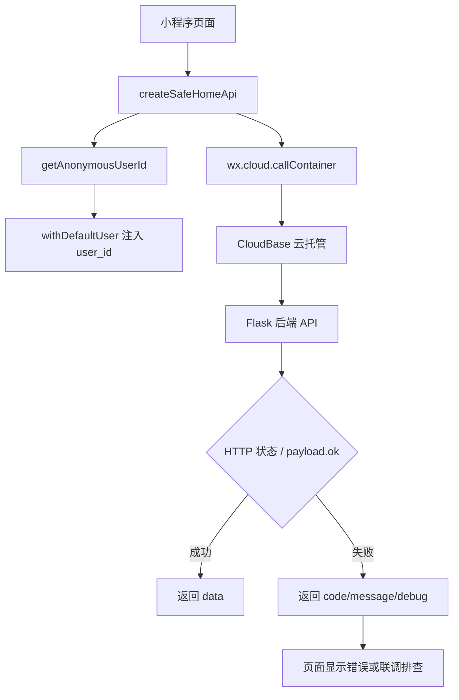

说明：

```text
小程序端会在错误中保留 env、service、path、method 等 debug 信息，用于排查云环境、服务名、路径和后端状态。
```

---

## 18. content 内容库加载与使用流程

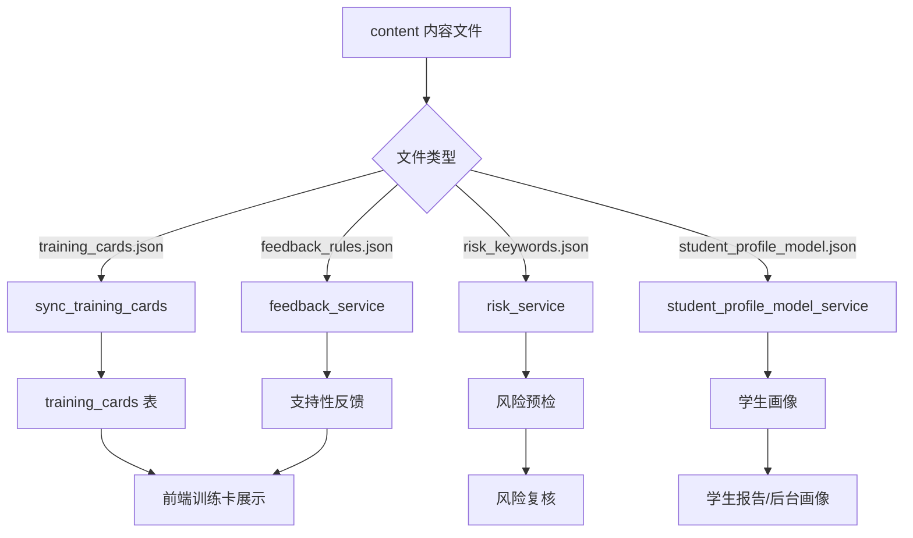

---

## 19. records 统一研究摘要流程

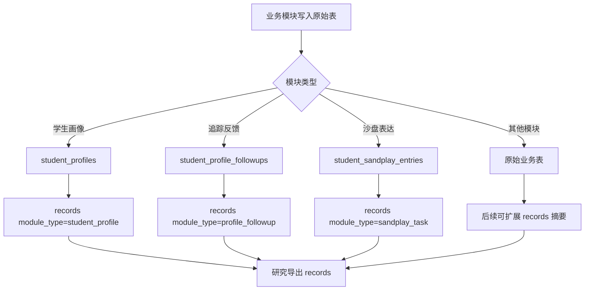

说明：

```text
records 是研究摘要，不替代原始业务表。它用于把不同模块的数据统一到一个可查询、可导出的研究视角。
```

---

## 20. 审计日志流转图

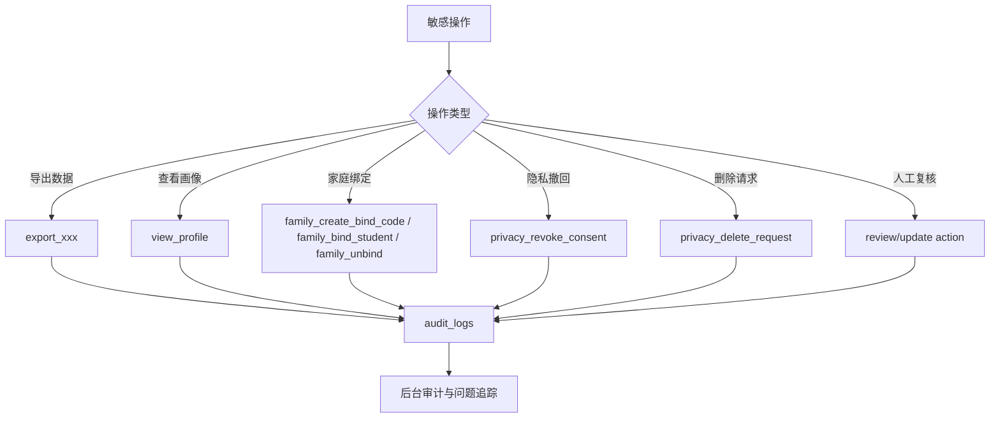

说明：

```text
审计日志用于回答“谁在什么时候做了什么敏感操作”，尤其适用于导出、风险复核、隐私请求和家庭绑定。
```

---

## 21. 权限校验流程

```mermaid
flowchart TD
    A[请求进入后端接口] --> B{是否有 X-Admin-Token}
    B -->|有| C[require_admin_token]
    C -->|通过| D[legacy admin actor]
    C -->|失败| E[401]
    B -->|无| F{是否有 Authorization Bearer}
    F -->|无| G[匿名/拒绝，取决于接口]
    F -->|有| H[verify_auth_token]
    H -->|过期/无效| I[401]
    H -->|有效| J[读取 users]
    J --> K{status active?}
    K -->|否| L[403]
    K -->|是| M[actor role]
    M --> N{require_role 是否满足}
    N -->|满足| O[继续业务逻辑]
    N -->|不满足| P[403]
```

---

## 22. 试点研究数据闭环图

```mermaid
flowchart TD
    A[家长使用系统] --> B[日记/反馈/训练卡/打卡]
    C[学生使用系统] --> D[测评/画像/追踪/沙盘]
    E[家庭绑定] --> F[family_links]
    B --> G[records / 原始业务表]
    D --> G
    F --> G
    G --> H[脱敏导出]
    H --> I[raw_wide / long / codebook / records]
    I --> J[统计分析]
    I --> K[质性访谈线索]
    J --> L[试点报告 / 论文材料]
    K --> L
```

---

## 23. 真实试点运行闭环图

```mermaid
flowchart TD
    A[试点开始] --> B[创建测试/正式账号]
    B --> C[家长完成目标和记录]
    C --> D[系统生成反馈和训练卡]
    D --> E[家长打卡]
    B --> F[学生完成画像测评]
    F --> G[学生查看阶段性报告]
    C --> H{是否触发风险}
    F --> H
    H -->|否| I[继续普通流程]
    H -->|是| J[进入人工复核]
    J --> K[督导处理]
    E --> L[周报]
    G --> L
    L --> M[研究后台查看]
    M --> N[脱敏导出]
    N --> O[试点数据分析]
    O --> P[向导师汇报]
```

---

## 24. 向导师讲解的一页图

```mermaid
flowchart LR
    A[家长情绪记录] --> B[非诊断支持性反馈]
    B --> C[训练卡练习]
    C --> D[打卡与周报]
    E[学生支持性测评] --> F[阶段性压力反应画像]
    F --> G[推荐任务与复核]
    D --> H[研究后台]
    G --> H
    H --> I[脱敏导出与试点分析]
    J[高风险文本] --> K[人工复核/督导]
    B -.边界.-> J
    F -.边界.-> J
```

适合口头解释：

```text
系统主线是“记录—反馈—练习—复盘”，学生端提供阶段性画像作为补充线索，高风险内容不走普通反馈，而进入人工复核。研究后台只看脱敏数据，用于试点评估和后续研究。
```
